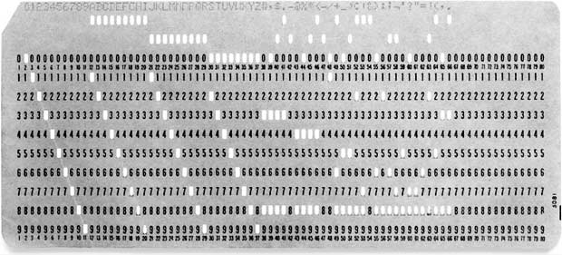
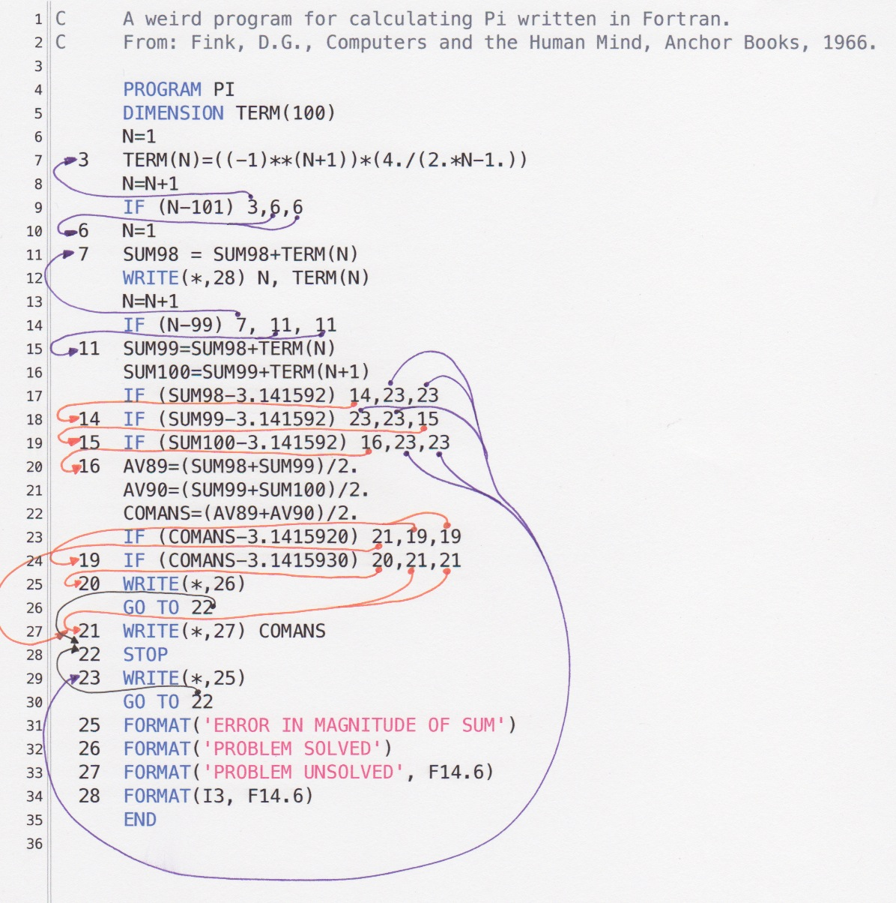
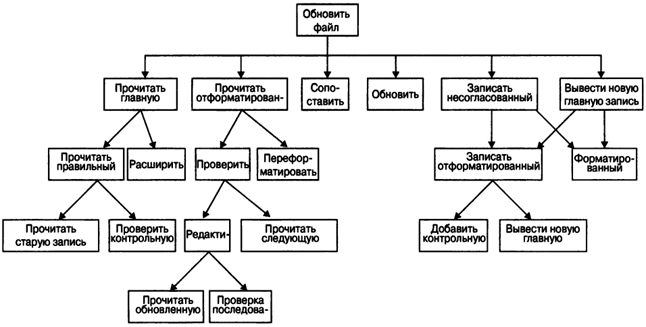
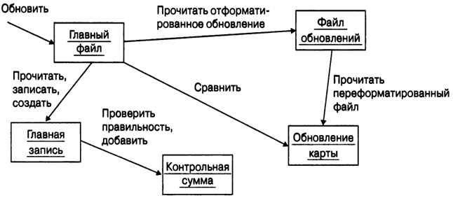
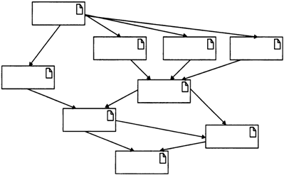
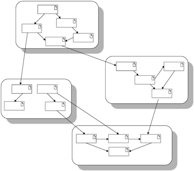

# Тема: Введение в дисциплину ООП. История и предпосылки возникновения ОО подхода. Основные понятия и задачи ОО подхода. Преимущества и недостатки ОО подхода.

> Если бы строители строили здания так же, как программисты пишут программы, первый залетевший дятел разрушил бы цивилизацию.
(с) Второй закон Вейнберга

Любая компьютерная программа, в конечном итоге, сводится к машинному коду - набору двоичных инструкций, которые выполняются центральным процессором.

Чтобы задать эти инструкции, на заре компьютерной эры, в 40-х годах ХХ века, от программистов требовалось физически использовать различные переключатели и менять месторасположение различных перемычек. Это было чудовищно неудобно, так как компьютерную программу необходимо было вводить в компьютер вручную.

<p align="center" style="margin:auto">
  
</p>

ENIAC, 27-тонный клубок из 18000 электронных ламп и диодов, занимавший площадь в 167 квадратных метров, считается первым в мире настоящим компьютером. Машина могла выполнить 5 000 операций в секунду.

В 50-х годах компьютеры начали использовать перфокарты. Перфокарты представляли собой картонные карточки, в которых необходимо было проделать в нужных местах отверстия, чтобы задать требуемые инструкции.

<p align="center" style="margin:auto">
  
</p>

## Языки низкого уровня

На заре компьютерной эры для программирования компьютеров использовался машинный код. Он представлял собой прямой набор инструкций процессора, а также аргументы для той или иной инструкции. Приведем пример программы для вывода надписи "Hello, world!" на машинном коде.

```
b8    21 0a 00 00   #moving "!\n" into eax
a3    0c 10 00 06   #moving eax into first memory location
b8    6f 72 6c 64   #moving "orld" into eax
a3    08 10 00 06   #moving eax into next memory location
b8    6f 2c 20 57   #moving "o, W" into eax
a3    04 10 00 06   #moving eax into next memory location
b8    48 65 6c 6c   #moving "Hell" into eax
a3    00 10 00 06   #moving eax into next memory location
b9    00 10 00 06   #moving pointer to start of memory location into ecx
ba    10 00 00 00   #moving string size into edx
bb    01 00 00 00   #moving "stdout" number to ebx
b8    04 00 00 00   #moving "print out" syscall number to eax
cd    80            #calling the linux kernel to execute our print to stdout
b8    01 00 00 00   #moving "sys_exit" call number to eax
cd    80            #executing it via linux sys_call
```

Для того, чтобы писать в машинных кодах, требуется досконально знать внутреннее устройство компьютера и подробности работы центрального процессора. Также, различные центральные процессоры различных фирм имели свой набор команд, что приводило к тому, что программа в машинных кодах писалась под конкретную модель центрального процессора.

### Язык ассемблера

Годом рождения языка ассемблера можно считать 1949 год. Язык ассемблера представляет собой систему обозначений, которая позволяет облегчить написание программ в машинном коде. Вместо кодов команд используются специальные обозначения (мнемоники), например `MOV` или `ADD`. Также, можно было использовать различные системы счисления, а также давать меткам символические имена. Приведем пример программы, которая печатает на экране "Hello, world!" (диалект NASM Linux).

```nasm
SECTION .data
msg     db "Hello, world!",0xa  
len     equ $ - msg
SECTION .text
global _start           
_start:                 ; Точка входа в программу
        mov eax, 4      ; 'write' системный вызов
        mov ebx, 1     
        mov ecx, msg    ; Указатель на данные
        mov edx, len    ; Количество данных
        int 0x80        ; Вызов ядра
        mov eax, 1      ; '_exit' системный вызов 
        mov ebx, 0      ; Возвращаем 0 (все хорошо)
        int 0x80        ; Вызов ядра
```

Необходимо отметить, что инструкции на языке ассемблера один в один транслируются в инструкции в машинных кодах (по крайней мере, так было изначально). Язык ассемблера предоставляет более удобную форму записи инструкций для процессора.

Особенностью программирования в машинных кодах и на языке ассемблера было то, что процесс разработки таких программ был очень медленный, отладка и поиск ошибок занимало огромное количество времени, а сами программы представляли собой научные расчеты для военной или аэрокосмической отрасли.

## Языки высокого уровня. Неструктурированные языки программирования

### FORTRAN и неструктурированные языки программирования

С течением времени, компьютеры становились все более производительными и дешевыми. Компьютерами заинтересовались не только военные и ученые, а и различные коммерческие фирмы, возникла потребность в разработке все более сложных программ, которые занимались не только научными расчетами. Существующие языки (ассемблер и язык машинных команд) не позволяли писать большие и сложные программы, к тому же, стал вопрос об удешевлении стоимости написания программ для бизнеса.

Все это сформировало потребность в развитии Computer Science и появлении принципиально новых языков программирования, которые бы позволили писать сложные программы и тратить меньше времени и денег на их производство, внедрение и поддержку.

Адмирал Грейс Хоппер, разработчик одного из высокоуровневых языков программирования, так описывала необходимость в новых инструментах для разработки компьютерных программ:

> Когда-то я была профессором математики. В то время я обнаружила, что есть студенты, которые не могут изучать математику. Затем мне поручили сделать так, чтобы предпринимателям было легко пользоваться нашими компьютерами. Оказалось, что вопрос не в том, смогут ли они изучать математику, а в том, захотят ли они. [ ... ] Многие из них говорили: "Выбросьте эти символы — я не знаю, что они означают, у меня нет времени их изучать". А тем, кто заявляет, что люди обрабатывающие данные, должны использовать математическую нотацию, я посоветую для начала обучить математической записи вице-президента или полковника или адмирала. Уверяю вас, я уже пробовала.

В конце 1953 года, сотрудник IBM Джон Бэкус предложил более практичную альтернативу языку ассемблера для программирования компьютера IBM 704, которая называлась FORTRAN. Первый компилятор для языка FORTRAN был разработан в апреле 1957 года.

Язык FORTRAN стал невероятно популярным языком высокого уровня и позволил существенно повысить эффективность разработки, внедрения и поддержки компьютерных программ.

Концепция языков высокого уровня позволяет существенно упростить и ускорить процесс разработки программного обеспечения. Основная черта высокоуровневых языков — это абстракция, то есть введение смысловых конструкций, кратко описывающих такие структуры данных и операции над ними, описания которых на машинном коде (или другом низкоуровневом языке программирования) очень длинны и сложны для понимания.

### Недостатки неструктурированного программирования

Для того, чтобы объяснить один из главных недостатков языков программирования того времени, приведем пример программы на языке FORTRAN

```fortran
C AREA OF A TRIANGLE WITH A STANDARD SQUARE ROOT FUNCTION
C INPUT - TAPE READER UNIT 5, INTEGER INPUT
C OUTPUT - LINE PRINTER UNIT 6, REAL OUTPUT
C INPUT ERROR DISPLAY ERROR OUTPUT CODE 1 IN JOB CONTROL LISTING
C READ INPUT TAPE 5, 501, IA, IB, IC
      read(*,*) IA, IB, IC
C  501 FORMAT (3I5)
C IA, IB, AND IC MAY NOT BE NEGATIVE OR ZERO
C FURTHERMORE, THE SUM OF TWO SIDES OF A TRIANGLE
C MUST BE GREATER THAN THE THIRD SIDE, SO WE CHECK FOR THAT, TOO
      IF (IA) 777, 777, 701
  701 IF (IB) 777, 777, 702
  702 IF (IC) 777, 777, 703
  703 IF (IA+IB-IC) 777, 777, 704
  704 IF (IA+IC-IB) 777, 777, 705
  705 IF (IB+IC-IA) 777, 777, 799
  777 STOP 1
C USING HERON'S FORMULA WE CALCULATE THE
C AREA OF THE TRIANGLE
  799 S = FLOAT(IA + IB + IC) / 2.0
      AREA = SQRT( S * (S - FLOAT(IA)) * (S - FLOAT(IB)) *
     +     (S - FLOAT(IC)))
C      WRITE OUTPUT TAPE 6, 601, IA, IB, IC, AREA
      write(*, 601) IA, IB, IC, AREA
  601 FORMAT (4H A= ,I5,5H  B= ,I5,5H  C= ,I5,8H  AREA= ,F10.2,
     +        13H SQUARE UNITS)

      END
```

Обратите внимание на строку

```fortran
701 IF (IB) 777, 777, 702
```

В этой строке проверяется переменная `IB`. Что означает запись `777,777,702`? Если переменная меньше или равна `0`, то выполняется строка с меткой `777` - программа останавливается с кодом ошибки `1`. Если переменная `IB` больше `0`, то выполняется строка с меткой `702` - происходит проверка переменной `IC`.

Программы того времени представляли собой большое полотно кода, который был плохо структурирован, а ветвления и циклы реализовывались с помощью переходов на определенную строку или метку.

По мере увеличения количества строк кода, такой способ написания программ приводил к такому явлению как "спагетти-код" (spaghetti code) - плохо структурированная и трудная для понимания программа.

<p align="center" style="margin:auto">
  
</p>

Спагетти-код назван так, потому что ход выполнения программы похож на миску спагетти, то есть извилистый и запутанный. Иногда называется «кенгуру-код» (kangaroo code) из-за множества инструкций «jump».

Инструкции перехода jump повсеместно применяются в машинном языке и в языке ассемблера, но в языках высокого уровня их использование приводило к тому, что когда программа разрасталась до определенного размера, ее модификация, поддержка и отладка становилась очень дорогой и медленной.
Для примера, сравните две программы для печати числе от `1` до `10` и их квадратов, реализованных на неструктурированном языке BASIC

```basic
10 i = 0
20 i = i + 1
30 if i <= 10 then goto 70
40 if i > 10 then goto 50
50 print "Программа завершена."
60 end
70 print i; " в квадрате = "; i * i
80 goto 20
```

и программы, написанной в структурном стиле.

```
for i = 1 to 10
    print i; " в квадрате = "; i * i
next i
print "Программа завершена."
```

Безусловно, неструктурированные языки были огромным шагом вперед по сравнению с языками низкого уровня, но они лишь на время отсрочили необходимость создания более совершенных языков и парадигм программирования, которые смогли бы открыть путь к безболезненной разработке более сложных программ.

## Software crisis и структурные языки программирования

Период середины с середины 60-х сегодня известен как "кризис программного обеспечения".

Термин software появился в 1958 году, а уже через 10 лет начали говорить о кризисе программного обеспечения — это словосочетание впервые прозвучало в 1968 году в докладе Питера Наура и Брайана Рэнделла «Программная инженерия», зачитанном на конференции Научного комитета НАТО.

На протяжении десятков лет появился целый ряд публикаций, посвященных Программному кризису 1.0. По оценке Пера Флаттена и его коллег, приведенной в докладе от 1989 года, в среднем на осуществление проекта разработки ПО уходило по 18 месяцев. Это консервативная оценка, если учесть, что в 1988 году авторы статьи в Business Week этот показатель назвали равным трем годам, а в 1982-м аналитики указывали, что на программные проекты уходит по пять лет.

В 1994 году в отчете об исследовании, проведенном специалистами IBM, утверждалось. что 68% всех программных проектов отстают от графика. Там же приводились сведения о том, что превышение бюджетов проектов разработки достигает 65%. Для обозначения программных систем, выпущенных, но неиспользуемых, даже придумали термин shelfware — «ПО на полку».

Эксперты компании Standish Group в докладе CHAOS Manifesto, выпущенном в 2011 году, сетуют на высокую долю провальных проектов, правда, применяемые ими методологию анализа и выводы подвергали сомнению. Программный кризис 1.0, похоже, уже прошел, и благодаря многочисленным инкрементальным усовершенствованиям процесса разработки ПО ситуация все-таки изменилась к лучшему. Практические перемены в конечном итоге привели к тому, что сегодня ПО, как правило, разрабатывается в пределах бюджета и отвечает техническим требованиям. К сожалению, теперь надвигается кризис 2.0, и, как показано на рисунке, его первопричина — неспособность создания ПО, эффективно использующего колоссальные объемы данных, которые появились за последние 50 лет, а также учитывающего возросшие технические характеристики устройств и требования их пользователей.

<p align="center" style="margin:auto">
  
</p>

Чтобы продемонстрировать рост вычислительных мощностей на протяжении 60х годов, приведем один пример. Мейнфрейм IBM 1401, выпущенный в 1959 году, выполнял до 193 300 операций сложения в минуту. Модель IBM 360/91, выпущенная в 1968 году, выполняла до 16 600 000 операций сложения в секунду!

Приведем отрывок из выступления Эдсгера Дейкстры на вручении Премии Тьюринга в 1972 году.

> Основная причина кризиса программного обеспечения заключается в том, что компьютеры стали на несколько порядков мощнее! Проще говоря: пока не было машин, программирование вообще не было проблемой; когда у нас было несколько слабых компьютеров, программирование стало небольшой проблемой, а теперь, когда у нас появились гигантские компьютеры, программирование стало столь же гигантской проблемой.

В соответствии с парадигмой, любая программа, которая строится без использования оператора go to, состоит из трёх базовых управляющих конструкций: последовательность, ветвление, цикл; кроме того, используются подпрограммы. При этом разработка программы ведётся пошагово, методом «сверху вниз».

Методология структурного программирования появилась как следствие возрастания сложности решаемых на компьютерах задач, и соответственно, усложнения программного обеспечения. В 1970-е годы объёмы и сложность программ достигли такого уровня, что традиционная (неструктурированная) разработка программ перестала удовлетворять потребностям практики. Программы становились слишком сложными, чтобы их можно было нормально сопровождать. Поэтому потребовалась систематизация процесса разработки и структуры программ.

Методология структурной разработки программного обеспечения была признана «самой сильной формализацией 70-х годов».

Статья Дейкстры в переводе - [ссылка](files/goto_article.pdf)

Структурное программирование основано на принципе "вызова процедуры", что является еще одним названием "вызова функции". Процедуры также называют функциями, подпрограммами или методами. Процедура содержит последовательность исполняемых инструкций. Любая процедура может быть вызвана в любое время выполнения программа. Процедура может быть вызвана из другой процедуры или даже может вызывать саму себя.

Изначально, все процедуры были доступны в любой части программы, также как и глобальные данные. В небольших программах это не представляло никаких проблем, но чем сложнее и больше становится программа, тем чаще небольшие изменения в одной части программы могли существенно повлиять на другие части. Сложные и большие программы порождали огромное количество запутанных зависимостей и малейшее изменение в одной процедуре могло привести к каскаду ошибок во многих других процедурах, которые зависели от изменяемой процедуры.

## Структурное vs объектно-ориентированное программирование

Дискуссии о том, какое программирование "лучше" не имеют смысла. Программирование, в том или ином виде, заключается в решении задачи, вы можете решить любую задачу с помощью любой парадигмы программирования, тем более, что многие языки программирования позволяют писать код в нескольких парадигмах.

Однако, не все парадигмы позволяют решать определенные задачи в равной степени эффективно. Таким образом, дискуссии насчет парадигмы программирования не имеют смысла, до тех пор, пока не определена задача, которую вы пытаетесь решить. Как только вы определили задачу и ее параметры, вы сможете понять, какая парадигма лучше подходит для ее решения.

### Сложность программного обеспечения

Одним из основных вызовов при разработке программного обеспечения является сложность программ. Этот вызов иногда называют «кризисом программного обеспечения».
Не всё программное обеспечение является сложным, существует большое количество «простых» программ, которые разрабатываются и поддерживаются одним человеком. Такие программы, как правило, имеют очень ограниченный функционал и используются в течение короткого периода времени. С написанием таких программ не возникает много проблем, поэтому для их написания вы можете использовать практически любые языки программирования, технологии и методы разработки программных продуктов.

Наибольшие проблемы возникают при разработке промышленного программного обеспечения. Такие программы используются довольно долго (годами и десятилетиями), и от их корректной работы зависят тысячи и даже миллионы людей. Это могут быть, например, системы управления воздушным транспортом, железнодорожными перевозками, банковские системы, системы коммунальных платежей, онлайн-игры, популярные веб-сайты и веб-службы и так далее.

Важнейшей особенностью промышленной программы является ее высокая сложность. Одному программисту не под силу решить все проблемы, связанные с проектированием такой системы. Грубо говоря, сложность промышленных программ превышает интеллектуальные возможности отдельного человека.

Со времени возникновения области разработки программного обеспечения, человечество накопило достаточно знаний, чтобы проектировать даже самые сложные системы программного обеспечения, но мы до сих пор сталкиваемся с огромным количеством  проблем. В чем же дело?

При анализе сложных систем, мы обнаруживаем много составных частей, которые взаимодействуют друг с другом разными довольно запутанными способами, причем части и способы их взаимодействия могут быть совершенно разными. При проектировании и организации сложных систем разработчику необходимо думать сразу о многом. Например, система управления воздушным транспортом должны одновременно контролировать состояние многих самолетов, учитывая, например, их местоположение, скорость и курс. К сожалению, один человек не может охватить все эти детали одновременно.
Таким образом, у нас возникает проблема сложность – программное обеспечение становится всё более сложным, а способности справиться с этой сложностью остаются ограниченными. Как же решить эту проблему?

### Декомпозиция программных систем

Одним из способов справиться со сложностью программных систем, это декомпозиция. При проектировании сложного программного обеспечения, необходимо разделять его на всё меньшие и меньшие части, каждую из которых можно обрабатывать независимо друг от друга. Таким образом, вместо работы над всей программной системой сразу, мы будем работать с ее отдельными частями.
Одним из методов декомпозиции является алгоритмическая декомпозиция. Вы сталкивались с таким видом декомпозиции на первом курсе, когда изучали дисциплину «Алгоритмизация и программирование». Алгоритмическая декомпозиция выполняется методом «сверху вниз», где каждый модуль системы выполняет один из этапов общего процесса. На рисунке ниже приведена часть программы, которая обновляет содержимое основного файла.
Другим видом декомпозиции называется объектно-ориентированная декомпозиция, которая вам пока неизвестна.

<p align="center" style="margin:auto">
  
</p>

При использовании этого вида декомпозиции, вместо разделения системы на этапы, например, «Прочитать отформатированное обновление» и «Добавить контрольную сумму», мы определяем такие объекты, как «Основной файл» и «Контрольная сумма», которые создаются при анализе предметной области. Ниже приведен пример ОО-декомпозиции для той же части программы.

<p align="center" style="margin:auto">
  
</p>

В случае ОО-декомпозиции, мир представляет собой совокупность автономных агентов, которые взаимодействуют друг с другом и обеспечивают более сложное поведение системы. Действие «Прочитать отформатированное обновление» больше не является независимым алгоритмом, это действие представляет собой операцию, связанную с объектом «Файл обновлений». В результате выполнения этой операции возникает другой объект – «Обновление карты». Таким образом, каждый объект в такой схеме реализует свое собственное поведение, и каждый из них моделирует некоторый объект реального мира. С такой точки зрения объект является материальной сущностью, обладающей определенным поведением. Получая сообщения, объекты выполняют определенные операции. Такая композиция основана на объектах, поэтому и называется объектно-ориентированной.

**Так какой же метод декомпозиции следует использовать?** Использовать оба метода одновременно нельзя – сначала следует произвести декомпозицию либо по алгоритмам, либо по объектам.

Многолетний опыт разработчиков программного обеспечения явно показывает, что объектно-ориентированная декомпозиция имеет много чрезвычайно важных преимуществ над алгоритмической. Декомпозицию следует начинать с объектов, поскольку она облегчает упорядочение сложных систем, таких как программное обеспечение, компьютеры, растения, галактики и крупные общественные институты. Преимущества объектно-ориентированной декомпозиции:

- уменьшается размер систем за счет повторного использования общих механизмов;
- объектно-ориентированные системы являются более гибкими и легче эволюционируют со временем;
- снижается риск, возникающий при создании сложной программной системы;
- ОО-декомпозиция позволяет лучше справиться со сложностью, характерной для систем программного обеспечения.

Объектно-ориентированная технология основана на использовании так называемой **объектной модели проектирования**, или просто **объектной модели**. К основным принципам этой модели относятся **абстракция**, **инкапсуляция**, **модульность**, **иерархия**, **контроль типов**, **параллелизм** и **персистентность**.

Языки, которые реализуют объектную модель, называют объектными или объектно-ориентированными. Пример структуры программ, написанных на объектно-ориентированных языках программирования, представлен на рисунке ниже.

<p align="center" style="margin:auto">
  
</p>

Основным элементом в этих языках является модуль, который представляет собой логическую связанную совокупность объектов и классов (понятие класса будет рассмотрено ниже). Такая структура является графом, а не деревом, как в случае использования алгоритмических языков. Кроме того, в ОО языках исключены глобальные данные. Данные и операции объединяются таким образом, что основными логическими конструктивными элементами ОО систем теперь являются объекты и классы, а не алгоритмы.

Объектная модель допускает масштабирование. В крупных системах образуются целые кластеры, образующие слои. Пример структуры крупных систем приведен на рисунке ниже.

<p align="center" style="margin:auto">
  
</p>

## Объектно-ориентированное программирование

ООП было спроектировано для того, чтобы облегчить проектирование, поддержку и повторное использование кода. Ключевыми концепциями ООП являются инкапсуляция и абстракция, которые используются для помощи в разработки больших и сложных программ. ООП - это инструмент для создания программ в миллионы строк кода таким способом, чтобы программы можно было понимать, управлять и поддерживать.

Корректное использование ООП позволяет делать код проще, безопаснее и проще для понимания и дальнейшей модификации. ООП также помогает повторно использовать функционал в другой части программы или даже в другой программе без серьезной модификации. Это помогает снизить повторное написание одного и того же кода и работу программиста в целом.

ООП также помогает делать код более стабильным и снижает количество багов, потому что когда часть кода корректно протестирована, вы можете быть уверен, что код не приведет к ошибкам при использовании его в другой части программы.
