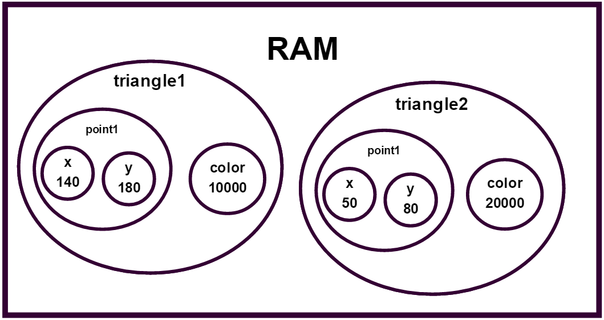
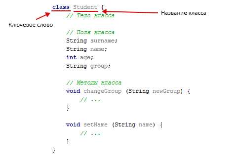
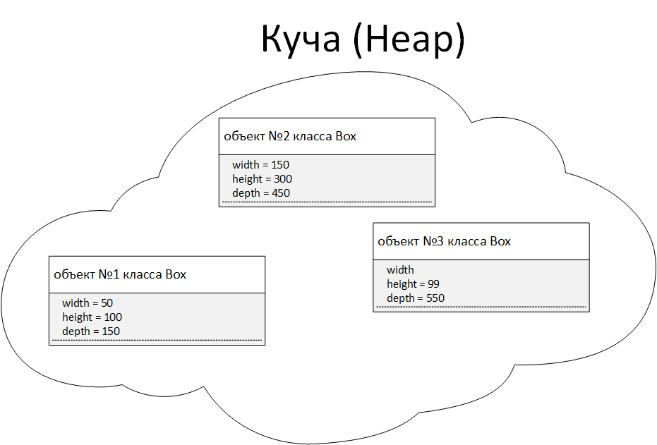
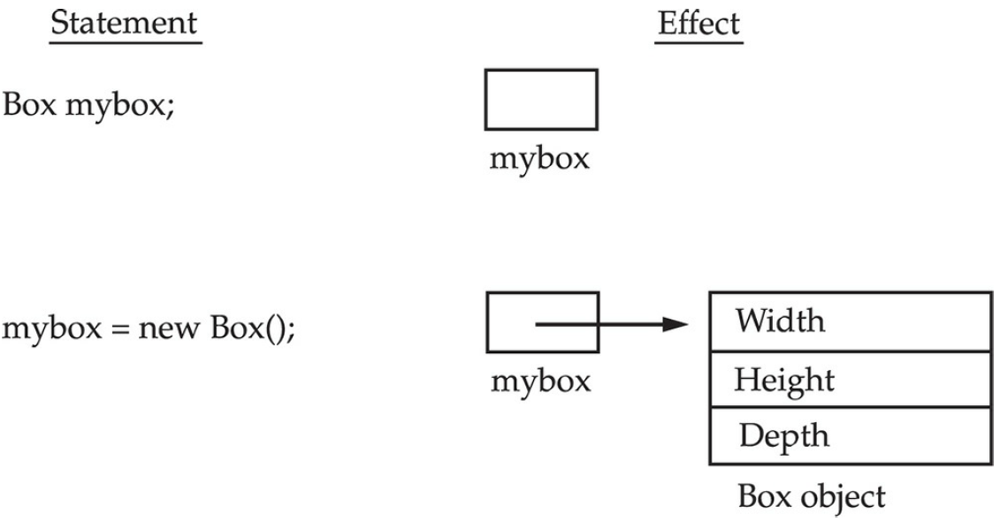
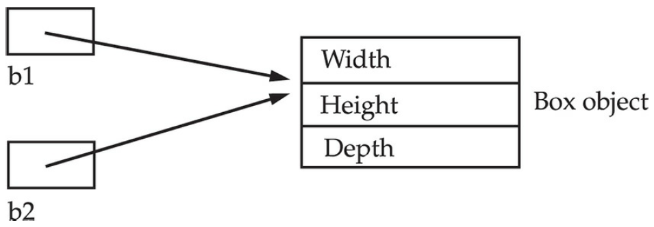

# Тема: Базовые понятия ООП. Создание объектов. Примитивные и ссылочные типы. Конструктор. Ключевое слово this

**Объектно-ориентированное программирование** – это методология программирования, основанная на представлении программы в виде совокупности взаимодействующих объектов, каждый из которых является экземпляром определенного класса, а классы являются членами определенной иерархии наследования.

**Объект** – структура, которая объединяет данные и методы, которые эти данные обрабатывают. Фактически, объект является основным строительным блоком объектно-ориентированных программ.

**Класс** – шаблон для объектов. Каждый объект является экземпляром (instance) какого-либо класса («безклассовых» объектов не существует). В рамках класса задается общий шаблон, структура, на основании которой создаются объекты. Данные, относящиеся к классу, называются полями класса, а программный код для их обработки называется методами класса. Поля и методы иногда называют общим термином – **члены класса**.

Разница между классом и объектом такая же, как между абстрактным понятием и реальным объектом. Объект состоит из следующих частей:

- **имя** объекта;
- **состояние (переменные состояния)**. Данные, содержащиеся в объекте, представляют его состояние. В терминологии ООП эти данные называются атрибутами. Например, атрибутами работника могут быть: имя, фамилия, пол, дата рождения, номер телефона. В разных объектах атрибуты имеют разное значение. Фактически, в объектах определяются конкретные значения тех переменных (полей класса), которые были заявлены при описании класса;
- **методы (операции)** – применяются для выполнения операций с данными, а также для совершения других действий. Методы определяют, как объект взаимодействует с окружающим миром.

Объекты могут отправлять друг другу сообщения. **Сообщение (message)** - это практически то же самое, что и вызов функции в обычном программировании. В ООП обычно употребляется выражение "послать сообщение" какому-либо объекту. Понятие "сообщение" в ООП можно объяснить с точки зрения ООП: мы не можем напрямую изменить состояние объекта и должны как бы послать сообщение объекту, что мы хотим как-то изменить его состояние. Очень важно понять, что объект сам меняет свое состояние, а мы можем только попросить его об этом с помощью отсылки сообщения.

> В объектно-ориентированной программе весь код должен находиться внутри классов!

В классе описываются, какого типа данные относятся к классу, а также то, какие методы применяются к этим данным. Затем, в программе на основе того или иного класса создается экземпляр класса (объект), в котором указываются конкретные значения полей и выполняются необходимые действия над ними.

## От языка С к объектно-ориентированному программированию

Давайте попробуем понять, что такое объект и класс с помощью языка программирования C.
Представим себе, что мы пишем программу для книжной лавки на языке C. В какой-то момент мы сталкиваемся с необходимостью хранить информацию о множестве книг: название книги, кто автор книги, год издания и стоимость книги. Как нам это запрограммировать?

Мы можем воспользоваться массивами и хранить данные о книгах в нескольких массивах.

```c
int book_year[100];
int book_pages[100];
char book_author[100][50];
char book_title[100][100];
float book_price[100];
```

Теперь мы можем обратиться к i-му номеру каждого массива для получения информации об i-ой книге.

```c
printf("%s-%s %d page", book_author[3], book_title[3], book_pages[3]);
```

Какими недостатками обладает данный способ работы с данными? Такой подход может приводить к многочисленным ошибкам (например, ошибки при работе с индексами массивов), такие данные тяжело модифицировать (удаление книги приводит к необходимости смещать влево часть элементов массивов), такой код неудобно читать, поддерживать и модифицировать.

Но самое главное - **мы мыслим в контексте структуры компьютера**, а не решаемой задачи. Для нас книга - это некий единый объект, который имеет некоторые параметры (атрибуты): название, количество страниц и так далее. Мы же представляем атрибуты этого объекта в виде отдельных записей в разных массивах, потому что на языке C мы вынуждены мыслить в терминах имеющихся структур данных (массивов, очередей, деревьев), а не в терминах отдельных объектов и их взаимоотношений. Это затрудняет понимание решаемой задачи (управление книжной лавкой и продажей книг), увеличивает количество ошибок в программе и на некотором этапе мы вообще перестаем понимать, что происходит в программе.

Для хотя бы какого-то решения этой проблемы и облегчения труда программиста, на некотором этапе в язык C было введено понятие **структуры** (ключевое слово `struct`).

Структура в языке C - это тип данных, создаваемый программистом, предназначенный для объединения данных различных типов в единое целое. Таким образом, мы можем сгруппировать данные, которые относятся к одной книге, в одну структуру.

Сначала мы должны описать структуру (новый тип данных).

```c
struct Book {
    char author[50];
    char title[100];
    int year;
    int pages;
    float price;
};
```

Таким образом, некоторое понятие реального мира (то есть, книга вообще, как понятие) в программе описан структурой `Book`. Экземпляр этого понятия (какая-то конкретная книга) в программе будет представлен экземпляром структуры - переменной типа `Book`. Мы объявляем экземпляр структуры, после чего мы сможет заполнить поля структуры и работать с ней дальше в программе.

```c
int main() {

    // Объявляем экземпляр структуры
    struct Book book1;

    // Заполняем поля экземпляра
    strcpy(book1.author,"Иванов А.А");
    strcpy(book1.title,"Программирование на Java");
    book1.pages = 255;
    book1.price = 350.25;
    book1.year = 2018;

    // Теперь мы можем работать с созданным экземпляром структуры
    printf("%s - %s, %d страниц", book1.author, book1.title, book1.pages);

    return 0;
}
```

Использование структур решает проблему лишь частично. Мы сгруппировали данные, но функции для работы с нашей структурой находятся вне структуры. 

Объект реального мира обладает не только атрибутами (автор книги, название книги, количество страниц и так далее), но и определенным поведением (книгу можно продать, купить, переместить на склад и так далее). При разработке сложных программных систем необходимо группировать не только данные, но и функции, которые работают с этими данными.

## Пример использования объектного подхода

Рассмотрим простой пример объектно-ориентированной программы. Представим, что мы программируем графический редактор, который может рисовать различные фигуры. Подумав над задачей, мы приходим к выводу, что в нашей программе должны быть объекты, которые представляют различные фигуры. Итак приступим.

Сначала мы должны создать классы и описать внутри этих классов данные, которые относятся к фигурам и поведение фигур в виде набора методов (функций).

Опишем класс для фигуры «Треугольник». Какие характеристики могут быть у класса «Треугольник»? От чего зависит набор характеристик? В принципе, любой объект является бесконечно сложным и для его описания понадобится бесконечно большое количество характеристик. Но для нашего простого графического редактора важными будут следующие параметры: координаты трех точек и цвет фигуры.

>Здесь вы должны понять очень важную вещь: набор данных в классе зависит от той программы, которую мы собираемся написать. Например, если бы мы писали более мощный графический редактор, в списке полей класса мы добавили бы отдельно цвет заливки и цвет линий фигуры, сам цвет мог быть не только сплошным, но и в виде какого-то узора и так далее.

Для указания класса в Java используется ключевое слово `class`, после чего идет название класса, далее мы ставим фигурные скобки и всё, что будет написано внутри фигурных скобок (переменные и функции) будет относиться к этому классу.

```java
class Triangle {
    
}
```

Какие переменные и типы данных будут моделировать координаты точек и цвет? Для моделирования цвета воспользуемся обычным целым числом (очень часто цвета моделируются обычным целочисленным значением).

```java
class Triangle {
    
    // Цвет треугольника
    int color;
}
```

Теперь попробуем подумать, а как нам смоделировать координаты трех точек? Если бы мы программировали на языке C, мы бы написали что-то вроде

```java
class Triangle {

    // Цвет треугольника
    int color;

    // Координаты точек треугольника
    int x1,y1,x2,y2,x3,y3;
}
```

Но давайте подумаем - координаты каждой точки логически связаны между собой и когда мы будем, например, перемещать треугольник или будем менять размер треугольника, будут одновременно меняться две переменные, которые моделируют одну точку. С точки зрения объектной модели, лучшим вариантом будет предусмотреть отдельную сущность, отдельный класс, который моделирует точку на двумерной плоскости. Таким образом, мы сгруппируем данные и код, который будет эти данные изменять (например, менять значение `X` и `Y`).

```java
class Point2D {
    
    int x;
    int y;
}
```

Теперь вернемся к классу `Triangle` и укажем, что в качестве координат у нас будут выступать три объекта класса `Point2D`.

```java
class Triangle {

    // Цвет треугольника
    int color;

    // Координаты трех точек
    Point2D point1;
    Point2D point2;
    Point2D point3;
}
```

Теперь давайте определимся с методами классов – то есть, с тем поведением, которое будут осуществлять объекты этих классов.

Какое поведение может быть у объекта класса «точка»? Совершенно точно это будет метод «изменить координаты». То есть, наша точка как отдельный объект может вести себя следующим образом – менять свои координаты. Давайте запрограммируем этот метод.

```java
class Point2D {

    int x;
    int y;

    void changeCoordinates(int new_x, int new_y) {
        x = new_x;
        y = new_y;
    }
}
```

Теперь давайте подумаем, какое поведение будет у треугольника? Что с ним можно сделать? Например, можно его перекрасить, можно его передвинуть в другое место на плоскости, можно его нарисовать на каком-то полотне и так далее. Давайте опишем некоторые из этих методов.

```java
class Triangle {

    int color; // Цвет треугольника

    // Координаты трех точек
    Point2D point1;
    Point2D point2;
    Point2D point3;

    // Меняем цвет фигуры
    void changeColor(int new_color) {
        color = new_color;
    }

    // Меняем расположение фигуры
    // Для наглядности будем передавать входные параметры
    // в виде 6 целых чисел
    void move(int x1, int y1, int x2, int y2, int x3, int y3) {
        point1.changeCoordinates(x1, y1);
        point2.changeCoordinates(x2, y2);
        point3.changeCoordinates(x3, y3);
    }
}
```

Итак, мы описали треугольник, но мы определили только понятие «треугольник», у нас нет их физически, код класса - это просто описание. Если вы создали java-проект, у вас, по умолчанию, будет присутствовать класс `Main` и функция `main()`. Пока что мы не будем объяснять, зачем нужен класс `Main`, а обратим внимание на метод `main()`. Этот метод является «точкой входа» в программу, с вызова этого метода начинается работа программы. Когда мы дойдем и выполним последнюю инструкцию внутри метода `main()`, приложение завершится.

Создадим внутри метода `main()` несколько объектов класса `Triangle`. Создание объектов мы будем рассматривать подробно в следующих лекциях, на данный момент мы просто скажем, что для создания объекта используется ключевое слово `new`. После создания объекта, мы можем обращаться к объекту и вызывать методы у объектов (как мы вызывали функции в C).

```java
public class Main {

    public static void main(String[] args) {

        // Создали один объект треугольника
        Triangle triangle1 = new Triangle();

        // Создали еще один объект треугольника
        Triangle triangle2 = new Triangle();

        // Для первого треугольника поменяли цвет
        triangle1.changeColor(10000);
        // Поменяли цвет для второго треугольника
        triangle2.changeColor(20000);

        // Создали объект первой точки треугольника
        // и назначили точке какие-то координаты
        triangle1.point1 = new Point2D();
        triangle1.point1.changeCoordinates(140,180);

        // Сделаем это же для первой точки второго треугольника
        triangle2.point1 = new Point2D();
        triangle2.point1.changeCoordinates(50,80);
    }
}
```

> Важно! Вы должны понять, что у разных объектов значения переменных будут разные!

То есть, где-то в оперативной памяти у нас создано два разных объекта. Внутри первого есть объект класса `Point2D`, внутри этого объекта есть две переменные типа `int`, у которых будут значения `140` и `180`. Внутри же второго треугольника будет свой объект `Point2D`, внутри которого будут совершенно другие две переменные типа `int`, у которых будут значения `50` и `80`. Это же будет касаться переменных `color` в двух разных объектах.

<p align="center" style="margin:auto">
  
</p>

Таким образом, когда мы описываем классы, мы заявляем, что объекты этих классов будут содержать определенные поля (набор переменных) и будут иметь набор методов (функций), которые можно вызвать у объекта. Каждый объект содержит свои переменные, но методы у них общие.

## Базовые понятия ООП

### Понятие объекта

**Объект** – структура, которая объединяет данные и методы, которые эти данные обрабатывают. Это позволят разграничить область применения методов. Объект – это строительный блок объектно-ориентированных программ. Объектно-ориентированная программа является, по сути, набором объектов. Объект состоит из трех частей:

- имя объекта;
- состояние (данные объекта, переменные состояния). Состояние объекта характеризуется перечнем всех свойств данного объекта и текущими значениями каждого из этих свойств;
- методы (операции).

**Данные объектов**. Данные, содержащиеся в объекте, представляют его состояние. В терминологии ООП, эти данные называются **атрибутами**. Например, атрибутами работника могут быть имя, фамилия, пол, дата рождения, номер телефона и так далее. В разных объектах атрибуты имеют разное значение.

**Поведение объектов**. Поведение объекта – то, что он может сделать (в структурном программировании это реализовывалось функциями, процедурами, подпрограммами).

**Сообщения** – механизм коммуникации между объектами. Например, когда объект `А` вызывает метод объекта `B`, объект `A` отправляет сообщение объекту `B`. Ответ объекта `B` определяется его возвращаемым значением. Только «открытые» методы могут вызываться другим объектом.

### Понятие класса

Каждый объект определяется общим шаблоном, который называется классом. В рамках класса задается общий шаблон, структура, на основе которой затем создаются объекты. Данные, относящиеся к классу, называются **полями класса**, а программный код для их обработки – **методами класса**. Поля и методы иногда называют общим термином – **члены класса**.

В классе описываются, какого типа данные относятся к классу, а также то, какие методы применяются к этим данным. Затем, в программе на основе того или иного класса создается экземпляр класса (объект), в котором указываются конкретные значения полей и выполняются необходимые действия над ними.

Согласно конвенции кода и правилам языка Java:

- каждый класс должен содержаться в своем отдельном файле с расширением `.java`;
- название файла должно совпадать с названием класса;
- класс должен быть именем существительным;
- имя класса должно его описывать;
- имя класса начинается с большой буквы;
- если имя состоит из нескольких слов, то каждое слово начинается с большой буквы.

Рассмотрим разницу между объектом и классом на примере. Определим класс `Cat` и `Dog`. Описание класса производится через указание полей (данных) и методов класса. Для класса `Cat` в качестве полей укажем `name` (кличку кота) и `color` (окрас). Для класса `Dog` задаем поля `name` (кличка), `color` (окрас) и `breed` (порода).

```java
class Dog {

    String name;
    String color;
    String breed;

    void bark() {
        // Лаять
    }

    void fawn() {
        // Вилять хвостом
    }
}
```

```java
class Cat {

    String name;
    String color;

    void catchMouse() {
        // Ловить мышей
    }

    void mew() {
        // Мяукать
    }
}
```

Помимо полей, определим методы для этих классов. **Методы** – это то, что может делать объект класса (или что можно делать с объектом). Коты будут мяукать, и ловить мышей, а собаки лаять и вилять хвостом.

Таким образом, мы определили шаблоны, на основании которых впоследствии будут создаваться экземпляры классов или объекты. Разница между классом и объектом такая же, как между абстрактным понятием и реальным объектом. При создании объекта класса задаются конкретные значения для полей. Когда мы говорим о собаке или кошке вообще, как понятии, мы имеем в виду домашних животных, у которых есть имя, окрас и прочие характеристики. Это абстрактные понятия, которые соответствуют классу. А вот если речь идет о конкретном Шарике или Мурзике, то это уже объекты, экземпляры класса.

### Синтаксис классов

Рассмотрим синтаксис описания классов в Java. Описание класса начинается с ключевого слова `class`. После этого следует имя класса и в фигурных скобках тело класса. Тело класса состоит из описания членов класса – полей и методов.

<p align="center" style="margin:auto">
  
</p>

Для объявления класса служит ключевое слово `class`. Упрощенная форма определения класса имеет вид:

```
class имя_класса {
    тип переменная_экземпляра_1;
    тип переменная_экземпляра_2;
    тип переменная_экземпляра_3;
...
    тип переменная_экземпляра_N;

    тип имя_метода_1(список параметров) {...}
    тип имя_метода_2(список параметров) {...}
...
    тип имя_метода_N(список параметров) {...}
}
```

Данные или переменные, определенные в классе, называются переменными экземпляра, поскольку каждый экземпляр класса (объект) содержит собственные копии этих переменных. Таким образом, данные одного объекта отделены и отличаются от данных другого объекта.

Код содержится в теле методов. В большинстве классов действия над переменными и доступ к ним осуществляют методы этого класса. Таким образом, методы определяют порядок использования данных класса.

### Пример простого класса

Создадим класс `Box`, который описывает контейнер, допустим, на каком-то складе.

```java
public class Box {
    
    double width;
    double height;
    double depth;
    
}
```

Класс `Box` определяет три переменные экземпляра: `width` (ширина), `height` (высота) и `depth` (глубина). В настоящий момент класс Box не содержит никаких методов.

Как мы уже говорили, класс определяет новый тип данных. В данном случае новый тип данных называется `Box`. Это имя будет использоваться для объявления объектов типа `Box`. Не следует забывать, что объявление `class` создает только шаблон, но не конкретный объект. Таким образом, приведенный выше код не приводит к появлению каких-нибудь объектов типа `Box`.

Чтобы действительно создать объект класса `Box`, нужно воспользоваться оператором `new`

```java
public class Main {
    public static void main(String[] args) {

        Box myBox = new Box();
    }
}
```

После выполнения этого оператора объект myBox станет экземпляром класса `Box`. Таким образом, он обретет "физическое" существование.

Также следует напомнить, что каждый объект содержит собственную копию переменной экземпляра, которая определена в классе. Каждый объект типа `Box` будет содержать собственные копии переменных `width`, `height` и `depth`.

<p align="center" style="margin:auto">
  
</p>

Изменения в переменных экземпляра одного объекта не влияют на переменные экземпляра другого объекта. Таким образом, каждый объект класса `Box` будет содержать собственные копии переменных `width`, `height` и `depth`. Для доступа к этим переменным служит оператор-точка `.`. Эта операция связывает имя объекта с именем переменной экземпляра. Например, чтобы присвоить переменной `width` экземпляра `myBox` значение `100`, нужно выполнить следующий оператор:

```java
myBox.width = 100;
```

Этот оператор предписывает компилятору, что копии переменной `width`, хранящейся в объекте `myBox`, требуется присвоить значение `100`. В общем, операция-точка служит для доступа как к переменным экземпляра, так и к методам в пределах объекта.

Ниже приведет пример программы, в которой используется класс `Box`

```java
public class Main {
    public static void main(String[] args) {

        // Создаем объект типа Box
        Box myBox = new Box();

        // Присваиваем значения переменным экземпляра myBox
        myBox.width = 10;
        myBox.height = 20;
        myBox.depth = 15;

        // Рассчитываем объем коробки
        double volume = myBox.width * myBox.height * myBox.depth;

        System.out.println("Объем равен: " + volume);
    }
}
```

```java
public class Box {

    double width;
    double height;
    double depth;
}
```

Как пояснялось ранее, каждый объект содержит собственные копии переменных экземпляра. Это означает, что при наличии двух объектов класса `Box` каждый из них будет содержать собственные копии переменных `width`, `height` и `depth`. Следует, однако, иметь ввиду, что изменения в переменных экземпляра одного объекта не влияют на переменные экземпляра другого. Например, в следующей программе объявлены два объекта класса `Box`:

```java
public class Main {
    public static void main(String[] args) {

        Box myBox1 = new Box();
        Box myBox2 = new Box();

        // Присваиваем значения для mybox1
        myBox1.width = 10;
        myBox1.height = 20;
        myBox1.depth = 15;

        // Присваиваем значения для mybox2
        myBox2.width = 3;
        myBox2.height = 6;
        myBox2.depth = 9;

        double volume;

        // объем первой коробки
        volume = myBox1.width * myBox1.height * myBox1.depth;
        // будет выведено 3000
        System.out.println("Объем равен: " + volume);

        // объем второй коробки
        volume = myBox2.width * myBox2.height * myBox2.depth;
        // будет выведено 162
        System.out.println("Объем равен: " + volume);
    }
}
```

Программа выводит следующий результат:

```
Объем равен: 3000.0
Объем равен: 162.0
```

Как видите, данные из объекта `myBox1` полностью изолированы от данных, содержащихся в объекте `myBox2`.

### Методы класса

Как упоминалось ранее, классы состоят из двух компонентов: переменных экземпляра и методов. Общая форма метода выглядит следующим образом:

```
[возвращаемый тип] имя ([список параметров]) {
    [тело метода]
}
```

где возвращаемый тип означает конкретный тип данных, возвращаемый методом. Он может быть любым допустимым типом данных, в том числе и типом созданного класса.

Если метод не возвращает значение, то его возвращаемым типом должен быть `void`.

В качестве имени методов может быть любой допустимый идентификатор, кроме тех, которые уже используются другими элементами кода в текущей области действия. А **список параметров** обозначает последовательность пар "тип-идентификатор", разделенных запятыми. По существу, параметры - это переменные, которые принимают значения аргументов, передаваемых методу во время его вызова. Если у метода отсутствуют параметры, то список параметров оказывается пустым.

Методы, возвращаемый тип которых отличается от `void`, возвращают значение вызывающей части программы с помощью оператора `return`.

Вернемся к нашему примеру с классом `Box`. Было бы логично, если бы расчет объема коробки выполнялся в классе `Box`, поскольку объем коробки зависит от ее размеров.

Для этого добавим в класс `Box` метод `getVolume()`

```java
class Box {

    double width;
    double height;
    double depth;
    
    void getVolume() {
        System.out.print("Объем коробки равен ");
        System.out.println(width * height * depth);
    }
}
```

Внимательно рассмотрим две следующие строки кода

```java
mybox1.volume();
mybox2.volume();
```

В первой строке вызывается метод `volume()` для объекта `myBox1`. Следовательно, метод `volume()` вызывается по отношению к объекту `myBox1`, для чего было указано имя объекта, а вслед за ним - операция-точка. Таким образом, в результате вызова метода `myBox1.volume()` выводится объем коробки, определяемого объектом `myBox1`, а в результате вызова метода `myBox2.volume()` - объем коробки, определяемого объектом `myBox2`.

При вызове метода `myBox1.volume()` исполняющая среда Jаvа передает управление коду, определенному в теле метода `volume()`. По окончании выполнения всех операторов в теле метода управление возвращается вызывающей части программы и далее ее выполнение продолжается со строки кода, следующей за вызовом метода. В самом общем смысле метод - это способ реализации подпрограмм в Java.

В методе `volume()` следует обратить внимание на еще одну очень важную особенность: ссылка на переменные экземпляра `width`, `height` и `depth` делается непосредственно без указания перед ними имени объекта или операции-точки. Когда в методе используется переменная экземпляра, определенная в его же классе, это делается непосредственно, без указания явной ссылки на объект и применения операции-точки.

Это становится понятным, если немного подумать. Метод всегда вызывается по отношению к какому-то объекту его класса. Как только этот вызов сделан, объект известен. Таким образом, в теле метода вторичное указание объекта совершенно излишне. Это означает, что переменные экземпляра `width`, `height` и `depth` неявно ссылаются на копии этих переменных, хранящиеся в объекте, который вызывает метод `volume()`.

Подведем краткие итоги. Когда доступ к переменной экземпляра выполняется из кода, не входящего в класс, где определена переменная экземпляра, следует непременно указать объект с помощью операции-точки. Но когда такой доступ осуществляется из кода, входящего в класс, где определена переменная экземпляра, ссылка на переменную может делаться непосредственно. Эти же правила относятся и к методам.

Следует обратить внимание, что метод `getVolume()` возвращает значение `3000`, и это значение рассчитанного объема сохраняется в переменной `vol`. При обращении с возвращаемыми значениями следует принимать во внимание два важных обстоятельства:

- тип данных, возвращаемых методом, должен быть совместим с возвращаемым типом, указанным в методе. Так, если какой-нибудь метод должен возвращать логический тип `boolean`, то возвратить из него целочисленное значение нельзя;
- переменная, принимающая возвращаемое методом значение (например, `vol`), также должна быть совместима с возвращаемым типом, указанным для метода.

## Создание объектов

Когда мы объявляем новый класс, то мы фактически создаем новый тип данных, который можно использовать для объявления объектов данного типа. Создание объектов класса представляет собой двухэтапный процесс. Сначала следует объявить переменную типа класса.

```java
Box myBox;
```

Эта переменная является **ссылочной**, то есть она не содержит объект, а ссылается на него (примерно как указатель в C не содержит значение, а содержит адрес, то есть переменная ссылается на значение в памяти).

Затем нужно создать конкретный физический объект и получить на него ссылку. Эти операции выполняются с помощью оператора `new`. Этот оператор динамически (то есть, во время выполнения программы) резервирует память для объекта, инициирует процесс создания объекта и возвращает ссылку на него (ссылка представляет собой адрес объекта в памяти). Далее нам необходимо сохранить ссылку в переменной.

```java
Box myBox;
mybox = new Box();
```

В первой строке переменная `mybox` объявляется как ссылка на объект типа `Box`. В данный момент `mybox` пока еще не ссылается на конкретный объект, значение переменной равно `null`. В следующей строке кода выделяется память для конкретного объекта, а переменной `mybox` присваивается ссылка на этот объект.

После выполнения второй строки кода переменную mybox можно использовать так, как если бы она была объектом типа `Box`. Но в действительности переменная `mybox` просто содержит адрес памяти конкретного объекта типа `Box`. Результат выполнения этих двух строк кода показан на рисунке.

<p align="center" style="margin:auto">
  
</p>

### Присвоение переменным ссылок на объекты

Какие действия выполняет приведенный ниже фрагмент кода?

```java
Box b1 = new Box();
Box b2 = b1;
```

На первый взгляд, переменной `b2` присваивается ссылка на копию объекта, на которую ссылается переменная `b1`. Таким образом, может показаться, что переменные `b1` и `b2` ссылаются на совершенно разные объекты, но это не так.

После выполнения данного фрагмента кода обе переменные, `b1` и `b2`, будут ссылаться на один и тот же объект. Таким образом, любые изменения, внесенные в объекте по ссылке в переменную `b2`, окажут влияние на объект, на который ссылается переменная `b1`, поскольку это один и тот же объект.

<p align="center" style="margin:auto">
  
</p>

### Передача аргументов подпрограмме

В общем случае, для передачи аргументов подпрограмме (в данном случае, методу) в языках программирования имеются два способа.

Первым способом является **передача по значению**. В этом случае значение аргумента копируется в параметр метода. Следовательно, изменения, вносимые в параметр метода, не оказывают никакого влияния на аргумент.

Вторым способом является **передача по ссылке**. В этом случае параметру передается ссылка на значение аргумента. Изменения, вносимые в параметр метода, будет оказывать влияние на аргумент, используемый при вызове.

**Все аргументы в Java передаются по значению**, но конкретный результат зависит от того, какой именно тип данных передается: примитивный или ссылочный.

Когда методу передается аргумент примитивного типа, его передача происходит по значению. В итоге создается копия аргумента, и все, что происходит с параметром, принимающим этот аргумент, не оказывает никакого влияния за пределами вызываемого метода.

```java

public static void main(String[] args) {

    int x = 10; // x равен 10

    System.out.println(x); // x = 10
    foo(x); // в метод копируется значение х
    System.out.println(x); // x все еще 10
}

void foo(int x) {
    x = x * 2;
}
```

При передаче объекта в качестве аргумента методу ситуация меняется коренным образом, поскольку объекты, по существу, передаются при вызове по ссылке. Не следует, однако, забывать, что при объявлении переменной типа класса создается лишь ссылка на объект этого класса.

Таким образом, при передаче этой ссылки методу принимающий ее параметр будет ссылаться на тот же самый объект, на который ссылается и аргумент. По существу, это означает, что объекты действуют так, как будто они передаются методам по ссылке. Но изменения объекта в теле метода оказывают влияние на объект, указываемый в качестве аргумента.

```java
public class Main {
    public static void main(String[] args) {
        Box mybox = new Box();
        mybox.width = 100;

        System.out.println(mybox.width); // Выведет 100
        foo(mybox);
        System.out.println(mybox.width); // Выведет 200
    }

    static void foo(Box mybox) {
        // В этом методе мы работаем с одним и тем же объектом
        // что и в методе main
        mybox.width = mybox.width * 2;
    }
}

class Box {
    double width;
}
```

### Конструктор

Основной причиной чрезмерных затрат в программировании является "небезопасное" программирование.

Основные проблемы с безопасностью относятся к инициализации и завершению. Очень многие ошибки при программировании на языке C обусловлены неверной инициализацией переменных. Это особенно часто происходит при работе с библиотеками, когда пользователи не знают, как нужно инициализировать компонент библиотеки или забывают это сделать.

В языке C++ впервые появляется понятие **конструктора** - специального метода, который вызывается при создании нового объекта.

В Java разработчик класса может в обязательном порядке выполнить инициализацию каждого объекта при помощи специального метода, называемого **конструктором**. Если у класса имеется конструктор, Java автоматически вызывает его при создании объекта, перед тем как пользователи смогут обратиться к этому объекту. Таким образом, инициализация объекта гарантирована.

> Конструктор – это специальный метод, который вызывается при создании нового объекта.

Синтаксис конструктора отличается от синтаксиса обычного метода. Его имя совпадает с именем класса, в котором он находится, и он не имеет возвращаемого типа.

Как было сказано выше, оператор `new` динамически выделяет оперативную память для создания объекта. Общая форма использования оператора `new` выглядит следующим образом

```java
переменная_типа_класса = new имя_класса();
```

Имя класса, за которым следуют круглые скобки, обозначает конструктор данного класса. Конструкторы являются важной частью всех классов и обладают множеством важных свойств. В большинстве классов, используемых в реальных программах, явно объявляются свои конструкторы в пределах определения класса.

Инициализация всех переменных класса при каждом создании объекта – занятие довольно утомительное. В связи с этим, в Java разрешается выполнять собственную инициализацию при создании объектов. Такая инициализация осуществляется с помощью конструктора.

```java
public class Box {

    double width;
    double height;
    double depth;

    public Box(double wd, double ht, double dt) {
        width = wd;
        height = ht;
        depth = dt;
    }
}

...

Box mybox = new Box(100, 200, 300);
```

Еще раз обратите внимание, что имя конструктора совпадает с именем класса, в котором он находится, а синтаксис аналогичен синтаксису метода. Также конструктор не имеет возвращаемого типа - даже типа `void`.

> Большинство IDE для Java имеют механизм для генерации конструкторов. В IntelliJ IDEA нажмите комбинацию `Alt+Insert` находясь в окне редактирования java-файла. Откроется контекстное меню `Generate`, где вы можете выбрать генерацию конструктора, после чего указать поля для инициализации.

Теперь нам должно быть понятно, почему при создании нового объекта, после имени класса требуется указывать круглые скобки. В действительности оператор `new` вызывает конструктор класса.

Оператор `new` вызывает конструктор `Box()`. Но мы ранее не создавали этот конструктор, почему компилятор не выдал ошибку, когда мы запускали приложение?

> Если в классе не определен конструктор, то в Java будет автоматически предоставлен конструктор по умолчанию.

Конструктор не получающий аргументов, называется **конструктором по умолчанию** (в документации Java он называется **конструктор без аргументов**).

Конструктор по умолчанию инициализирует все переменные экземпляра устанавливаемыми по умолчанию значениями, которые могут быть нулевыми, пустыми (`null`) и логическими (`false`) для числовых, ссылочных и логических типов соответственно. Зачастую конструктора по умолчанию оказывается достаточно для простых классов. Если же вы определите в классе хотя бы один конструктор, то конструктор по умолчанию создан не будет. Именно поэтому, следующий код выдаст ошибку.

## Ключевое слово this

Представим, что у нас есть два объекта одного класса и для этих двух объектов вызывается один и тот же метод:

```java
public class Box {

    double width;
    double height;
    double depth;
    
    public double getArea() {
        return width * height * depth;
    }
}

...

Box box1 = new Box();
Box box2 = new Box();

box1.getArea();
box2.getArea();
```

Если существует один метод `getArea()`, как метод узнает, для какого объекта он вызывается – для `box1` или для `box2`?

Оказывается, при вызове метода `getArea()` (как и при вызове любого другого метода) передается скрытый первый аргумент – ссылка на используемый объект. Таким образом, вызовы методов на самом деле можно представить как:

```java
Box.getArea(box1);
Box.getArea(box2);
```

Передача дополнительного аргумента относится к внутреннему синтаксису. При попытке явно воспользоваться ею компилятор выдаст сообщение об ошибке.

Предположим, во время выполнения метода нам необходимо получить ссылку на текущий объект. Так как эта ссылка передается компилятором скрытно, идентификатора для нее не существует. Но для решения этой задачи существует ключевое слово `this`.

Ключевое слово `this` может использоваться только внутри не-статического метода и предоставляет ссылку на объект, для которого был вызван метод.
Обращаться с ней можно точно так же, как и с любой другой ссылкой на объект. Для вызова метода класса из другого метода этого же класса, использовать ключевое слово `this` не нужно.

Ключевое слово `this` чаще всего используется в ситуации, когда локальная переменная скрывает поле класса. В Java не допускается объявление двух локальных переменных с одним и тем же именем в той же самой области видимости. Однако, мы можем объявить локальные переменные, имена которых совпадают с именами полей класса.

```java
public class Box {

    double width;
    double height;
    double depth;

    // Пример сокрытия поля класса
    void foo(double width) {
        double height = 100;

        // В консоль будет выведено значение локальных переменных
        System.out.println(width);
        System.out.println(height);
    }
}
```

Когда имя локальной переменной совпадает с именем переменной экземпляра, **локальная переменная скрывает поле класса**.

Можно решить эту ситуацию путем изменения имен локальных переменных, но это некорректно с точки зрения хорошего стиля написания кода. Грамотным решением является использование ключевого слова `this`. Это позволит переменным иметь одинаковые названия, а к переменным экземпляра можно будет обратиться с помощью этого ключевого слова.

```java
public class Box {

    double width;
    double height;
    double depth;

    // Пример сокрытия поля класса

    void foo(double width) {
        double height = 100;

        // В консоль будет выведено значение локальных переменных
        System.out.println(width);
        System.out.println(height);
        
        // Теперь мы обращаемся к переменным экземпляра
        System.out.println(this.width);
        System.out.println(this.height);
    }
}
```

Таким образом, ключевое слово `this` предоставляет ссылку на объект, для которого был вызван метод. Обращаться с ней можно как и с любой другой ссылкой на объект.
