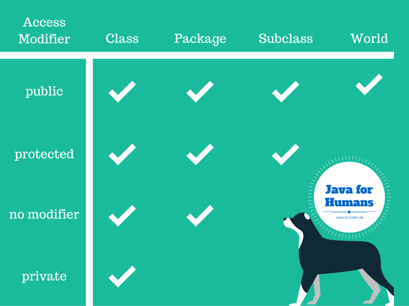

# Тема: Понятие инкапсуляции. Интерфейс и реализация. Инкапсуляция в Java. Геттеры и сеттеры. Инкапсуляция при проектировании классов.

Одним из основных преимуществ использования объектов заключается в том, что объекту не нужно показывать все свои атрибуты и поведения. При хорошем объектно-ориентированном проектировании, объект должен показывать только интерфейсы, необходимые другим объектам для взаимодействия с ним. Детали, не относящиеся к использованию объекта, должны быть скрыты от всех других объектов.

Инкапсуляция определяется тем, что объекты содержат как атрибуты, так и поведение. Сокрытие данных является одной из основных частей инкапсуляции. Например, объект, который применяется для вычисления квадратов чисел, должен обеспечивать интерфейс для получения результатов. Однако внутренние атрибуты и алгоритмы, используемые для вычисления квадратов чисел, не нужно делать доступными для запрашивающего объекта.

## Инкапсуляция

**Инкапсуляция** – один из основополагающих принципов ООП. Инкапсуляция – это одна из причин, почему так широко используется ООП.

Инкапсуляцию можно считать защитной оболочкой, которая предохраняет код и данные от произвольного доступа со стороны другого кода, находящегося снаружи оболочки. Доступ к коду и данным, находящимся внутри оболочки, строго контролируется тщательно определенным интерфейсом (набором общедоступных, публичных методов).

**Инкапсуляция** - основной принцип ООП, позволяющий пользователю не задумываться о сложности используемого программного компонента (что у него внутри?), а взаимодействовать с ним посредством предоставляемого интерфейса (публичных методов и членов), а также объединить и защитить жизненно важные для компонента данные. При этом пользователю предоставляется только спецификация (интерфейс) объекта. Пользователь может взаимодействовать с объектом только через этот интерфейс.

Программистов можно разделить на **создателей классов** (те, кто создает новые типы данных) и на **потребителей классов** (они используют уже кем-то ранее созданные классы для своих целей).

**Цель потребителей классов – как можно быстрее написать программу, используя уже кем-то ранее созданные классы (как кубики в конструкторе).**

**Цель создателей классов – построить класс, открывающий только то, что необходимо программисту-клиенту, и скрывающий все остальное.**

Почему так? Программист-клиент не сможет получить доступ к скрытым частям, а значит, создатель классов оставляет за собой возможность произвольно их изменять, не опасаясь, что это кому-то повредит. Скрытая часть обычно и самая «хрупкая» часть объекта, которую легко можно испортить неосторожный или несведущий программист-клиент, поэтому **сокрытие сокращает количество ошибок в программах**.

Создавая классы, вы устанавливаете отношения с программистом-клиентом. Если предоставить доступ ко всем членам класса кому угодно, программист-клиент сможет сделать с классом и нарушить логику его работы. Таким образом, **первой причиной ограничения доступа является необходимость уберечь «хрупкие» детали от программиста-клиента** – части внутренней кухни, не являющиеся составляющими интерфейса, при помощи которого пользователи решают свои задачи. На самом деле это полезно и пользователям – они сразу увидят, что для них важно, а на что можно не обращать внимания.

**Вторая причина ограничения доступа** – стремление **позволить разработчику классов изменять внутренние механизмы класса, не беспокоясь о том, как это отразится на программисте-клиенте**. Например, вы можете реализовать класс «на скорую руку», а затем переписать его, чтобы повысить скорость работы. При правильном разделении скрытой и открытой части, сделать это будет совсем несложно.

Никакая часть сложной системы не должна зависеть от внутреннего устройства какой-либо другой части.

<p align="center" style="margin:auto">
  
</p>

Разумная инкапсуляция должна локализовать проектные решения, которые могут измениться. По мере эволюции системы, ее разработчики могут обнаружить, что какие-то операции выполняются недопустимо долго, а какие-то объекты занимают слишком много памяти. В таких ситуациях внутреннее представление объекта, как правило, изменяется, чтобы реализовать более эффективные алгоритмы или оптимизировать использование памяти, заменяя хранение данных их вычислением.

Таким образом, можно сформулировать определение принципа инкапсуляции следующим образом:

**Инкапсуляция – это процесс отделения друг от друга элементов объекта, определяющих его устройство и поведения; инкапсуляция служит для того, чтобы изолировать контрактные обязательства от их реализации.**

## Интерфейс и реализация

В любом классе присутствуют две части: **интерфейс** и **реализация**.

**Интерфейс отражает внешнее поведение объектов этого класса. Внутренняя реализация описывает представления и механизмы достижения желаемого поведения объекта.**

В интерфейсе собрано все, что касается взаимодействия данного объекта с другими объектами, а реализация скрывает от других объектов все детали, не имеющие отношения к процессу взаимодействия объектов.

Интерфейс определяет основные средства коммуникации между объектами. При проектировании любого класса предусматриваются интерфейсы для надлежащего создания экземпляров и эксплуатации объектов. Любое поведение, которое обеспечивается объектом, должно вызываться через сообщение, отправляемое с использованием одного из представленных интерфейсов (то есть, любое поведение объекта реализуется через вызов публичного метода).

В случае с интерфейсом должно предусматриваться полное описание того, как пользователи соответствующего класса будут взаимодействовать с этим классом.

Для того чтобы сокрытие данных произошло, все атрибуты должны быть объявлены как `private`. Поэтому атрибуты никогда не являются частью интерфейсов. Частью интерфейсов классов могут быть только публичные методы. Объявление атрибута как `public` нарушает концепцию сокрытия данных.

Инкапсуляция позволяет локализовать части реализации системы, которые могут подвергнуться изменениям. По мере развития программы, разработчики могут принять решение изменить внутреннее устройство тех или иных объектов с целью улучшения производительности или экономии памяти. Но интерфейс будет нетронутым и позволит другим объектам таким же способом взаимодействовать с этим объектом. (Пример автомобиля – педали, руль, приборная панель и внутренняя начинка).

## Инкапсуляция в Java

Инкапсуляция в Java реализована с помощью использования модификаторов доступа.
Язык Java предоставляет несколько уровней защиты, которые позволяет настраивать область видимости данных и методов. В Java имеется четыре категории видимости элементов класса:

- `private` – члены класса доступны только членам данного класса. Всё что объявлено `private`, доступно только конструкторам и методам внутри класса и нигде больше. Они выполняют служебную или вспомогательную роль в пределах класса и их функциональность не предназначена для внешнего пользования. Закрытие (`private`) полей обеспечивает инкапсуляцию;
- **по умолчанию (package-private)** – члены класса доступны классам, которые находятся в этом же пакете;
- `protected` – члены класса доступны классам, находящимся в том же пакете, и подклассам – в других пакетах;
- `public` – члены класса доступны для всех классов в этом и других пакетах.

Модификатор класса указывается перед остальной частью описания типа отдельного члена класса. Это означает, что именно с него должен начинаться оператор объявления класса.

```java
public String errMessage;
private AccountBalance balance;

private boolean isError(byte status) {}
public class Account {}
```

Модификатор доступа указывается перед остальной частью описания типа отдельного члена класса (то есть, именно с модификатора доступа начинается объявление члена класса).

Когда член класса обозначается модификатором доступа `public`, он становится доступным для любого другого кода в программе, включая и методы, определенные в других классах.

Когда член класса обозначается модификатором `private`, он может быть доступен только другим членам этого класса. Следовательно, методы из других классов не имеют доступа к закрытому члену класса.

При отсутствии модификатора доступа, члены класса доступны другим членам класса, который находится в этом же пакете.

Модификатор доступа `protected` связан с использованием механизма наследования и будет рассмотрен позже.

Член класса (переменная, конструктор, методы), объявленный `public`, доступен из любого метода вне класса.

Всё что объявлено `private`, доступно только конструкторам и методам внутри класса и нигде больше. Они выполняют служебную или вспомогательную роль в пределах класса и их функциональность не предназначена для внешнего пользования. Закрытие (`private`) полей обеспечивает инкапсуляцию.

<p align="center" style="margin:auto">
  
</p>

## Доступ к полям через геттеры и сеттеры.

В подавляющем большинстве случаев, поля класса объявляются как private (это не касается статических переменных и констант, там ситуация может быть другая). Должны быть веские основания объявить поле класса общедоступным. Манипулирование данными должно осуществляться только с помощью методов.
Для того чтобы дать возможность получить доступ к переменной или дать возможность изменить ее значение, объявляют специальные методы, которые называются "геттерами" и "сеттерами".
Геттер возвращает значение приватного поля, тогда как сеттер меняет значение приватного поля (новое значение передается в качестве аргумента метода).
Хотя сигнатура и имена геттеров и сеттеров могут быть любыми, приучите себя соблюдать строгий шаблон для объявления геттеров и сеттеров.
Геттер должен иметь префикс get, после которого идет название поля с большой буквы. Геттер, как правило, не имеет входных аргументов.
Сеттер должен иметь префикс set, после которого идет название поля с большой буквы. Сеттер принимает на вход новое значение поля. Возвращаемый тип, как правило, void.
public class Account {

    private double balance;

    public double getBalance() {
        return balance;
    }

    public void setBalance(double balance) {
        this.balance = balance;
    }
}
Большинство IDE для Java имеют механизм для генерации геттеров и сеттеров. В IntelliJ IDEA нажмите комбинацию Alt+Insert находясь в окне редактирования java-файла. Откроется контекстное меню Generate, где вы можете выбрать генерацию геттера и сеттера, после чего указать поля, для которых необходимо сгенерировать методы.
Инкапсуляция и сокрытие данных
Начинающие программисты часто путают понятия инкапсуляции и сокрытия данных.
Сокрытие данных означает защиту членов класса от нелегального или неавторизованного доступа.
Таким образом, мы можем сказать, что инкапсуляция автоматически реализует концепцию сокрытия данных, обеспечивая безопасность данных, делая переменную приватной.
Ключевые отличия между сокрытием данных и инкапсуляцией:
инкапсуляция помогает скрыть сложность программы. С другой стороны, сокрытие данных связано с безопасностью данных в программе;
инкапсуляция фокусируется на упаковке (помещении в капсулу) сложных данных, чтобы предоставить пользователю более простое представление объекта. С другой стороны, сокрытие данных направлено на ограничение использования данных с целью обеспечения безопасности данных;
при инкапсуляции данные могут быть общедоступными или приватными, но при сокрытии данных, данные должны быть только приватными;
сокрытие данных - это процесс, а также техника, тогда как инкапсуляция - это подпроцесс при сокрытии данных.
Пример использования инкапсуляции

Представим, что нам необходимо создать класс «Корзина» (Cart), который хранит в себе набор объектов класса «Товар» (Item).
Какие методы «Корзина» должна предоставлять для внешнего использования? Это могут быть, например, методы «Добавить товар», «Убрать последний добавленный товар», «Подсчет суммы цен товаров в корзине», «Повышение цен в корзине на N процентов» и «Снижение цен в корзине на N процентов».

Как вы можете заметить, это публичные методы, а значит, их можно вызвать через оператор-точку имея ссылку ну объект.
Cart cart = new Cart();
cart.addItem(new Item("Клавиатура", 2000));
Перечень этих публичных методов и составляет интерфейс класса – то есть, с помощью этих методов объект класса будет взаимодействовать с внешним миром. 
Эти методы имеют вполне четко определенные входные аргументы и могут возвращать значения четко определенных типов, и никак иначе. По аналогии с этим, поворот колес автомобиля осуществляется четко определенным образом – поворотом руля, и бензин надо заливать в четко определенное отверстие крышки бензобака, а не как-то еще.
То – как будет реализовано хранение товаров в корзине – это внутренняя логика класса и она не должна быть доступна внешнему миру, она должна быть скрыта от внешнего вмешательства. Другие классы, которые будут использовать объекты класса Cartне должны знать и не должны иметь доступ к тому – как там «внутри» реализовано хранение товаров, подсчет цен и изменение цены на определенный процент и так далее, они могут только лишь использовать предоставленные им публичные методы. Давайте реализуем «Корзину» с помощью структуры «стек», которая, в свою очередь, реализована обычным массивом.
public class Cart {

    private Item[] stack; // массив для реализации стека
    private int topIndex; // указатель на вершину стека

    // При создании корзины мы должны
    // указать максимальное количество элементов
    // в корзине
    public Cart(int capacity) {
        stack = new Item[capacity];
        topIndex = -1;
    }

    // Добавление нового товара в корзину
    public boolean addItem(Item item) {
        return push(item);
    }

    // Приватный метод, который реализует добавление в стек
    private boolean push (Item item) {
        // Добавляем товар в стек
        return true; // или false если не стек переполнен
    }
    
    // Удаление последнего добавленного товара в корзину
    public Item deleteLastAddedItem() {
        return pop();
    }

    // Приватный метод, который реализует извлечение из стека
    private Item pop() {
        return new Item(); // Извлеченный из стека товар
    }
}
Как мы видим, массив с товарами, указать на вершину стек объявлены как privateчлены класса. Это значит, что мы не можем получить к ним доступ извне – они доступны только внутри данного класса.
Cart cart = new Cart();
cart.addItem(new Item("Клавиатура", 2000));

// Данная инструкция вызовет ошибку компиляции
cart.topIndex = 4;
Программиста, который будет использовать класс Cart, не должна волновать ситуация с переполнением стека, с попыткой извлечь элемент из пустого стека, он не должен следить за указателем на вершину стека, он даже не должен знать что это стек. 
Для него объект класса Cart это некоторый объект, который предоставляет «услугу» в виде корзины товаров и с этой корзиной можно работать с помощью определенных публичных методов. 
В дальнейшем мы можем переделать класс Cart и поменять внутреннюю реализацию. Мы можем использовать структуру "очередь", мы можем использовать коллекции, мы можем иначе реализовать операции добавления и удаления элемента в стеке, но если мы сохраним интерфейс класса неизменным, то для внешнего мира эти изменения внутренней логики не будут важны и если мы поменяем внутреннюю логику одного небольшого участка программы, то вся остальная программа будет работать так же.
Инкапсуляция как инструмент защиты инварианта класса
Еще одно важное свойство инкапсуляции - защита инварианта класса.
Что такое инвариант класса? Простыми словами- это утверждение, которое (должно быть) истинно применительно к любому объекту данного класса в любой момент времени (за исключением переходных процессов в методах объекта).
Например, во второй лабораторной работе инвариантом класса TimeSpan должны быть следующие утверждения:
значение hours должно быть 0 или больше;
значение minutes должно быть от 0 до 59 включительно.
Без механизма инкапсуляции мы никак не может обеспечить инвариант класса, потому что любой сторонний код может получить доступ к полю объекта и установить любое значение.
public class Main {
    public static void main(String[] args) {

        TimeSpan span = new TimeSpan();
        span.minutes = 100;
        span.hours = -200;

    }
}

class TimeSpan {
    int hours;
    int minutes;
}
Если мы предусмотрим геттеры и сеттеры, это, само по себе, не защитит инвариант класса.
public class Main {
    public static void main(String[] args) {

        TimeSpan span = new TimeSpan();
        span.setMinutes(100);
        span.setHours(-200);

    }
}

class TimeSpan {
    private int hours;
    private int minutes;

    public int getHours() {
        return hours;
    }

    public void setHours(int hours) {
        this.hours = hours;
    }

    public int getMinutes() {
        return minutes;
    }

    public void setMinutes(int minutes) {
        this.minutes = minutes;
    }
}
Мы можем обеспечить инвариант класса с помощью проверках в методах setHours() и setMinutes(), чтобы не допустить его нарушения.
В данном случае, грамотным вариантом было бы создание метода setTimeSpan(), в котором мы можем защитить инварианты класса. 
public class Main {
    public static void main(String[] args) {

        TimeSpan span = new TimeSpan();
        span.setTimeSpan(1,40);
    }
}

class TimeSpan {
    private int hours;
    private int minutes;

    public int getHours() {
        return hours;
    }

    public int getMinutes() {
        return minutes;
    }

    public void setTimeSpan(int hours, int minutes) {

        if (hours < 0 || minutes < 0) {
            throw new IllegalArgumentException("Hours and(-or) minutes should be zero or bigger!");
        }

        this.hours = hours + (minutes / 60);
        this.minutes = minutes % 60;
    }
}
Разберем еще один пример - рассмотрим класс TimeInterval.
class TimeInterval {
    Date start;
    Date end;
}
Инвариантом класса TimeInterval будет то, что дата start не может быть хронологически позже даты end, то есть начало интервала не может быть позже по времени, чем его окончание.
Даже если мы предусмотрим геттер и сеттер, их наличие не будет автоматически значить наличие инкапсуляции.
class TimeInterval {
    private Date start;
    private Date end;

    public TimeInterval(Date start, Date end) {
        this.start = start;
        this.end = end;
    }

    public Date getStart() {
        return start;
    }

    public void setStart(Date start) {
        this.start = start;
    }

    public Date getEnd() {
        return end;
    }

    public void setEnd(Date end) {
        this.end = end;
    }
}
То есть, любой пользователь может воспользоваться сеттером и установить значения start и end таким образом, что start будет по времени позже чем end.
Грамотным вариантом было бы добавление публичного метода setInterval(), в котором бы осуществлялась проверка на соблюдение инварианта класса.
В нашем коде есть 4 точки, где инвариант может быть нарушен (два метода setInterval() и два конструктора). Обеспечив нужные проверки входных аргументов, мы можем гарантировать инвариант класса.
class TimeInterval {
    private Date start;
    private Date end;

    public TimeInterval(Date start, Date end) {
        setInterval(start, end);
    }

    public TimeInterval(Date start, long durationInMillis) {
        setInterval(start, durationInMillis);
    }

    public Date getStart() {
        return start;
    }

    public void setInterval(Date start, Date end) {
        if (start.after(end)) {
            throw new IllegalArgumentException("Start date should earlier or equal to end date!");
        }

        this.start = start;
        this.end = end;
    }

    public void setInterval(Date start, long durationInMillis) {
        if (durationInMillis < 0) {
            throw new IllegalArgumentException("duration in millis should be 0 or bigger!");
        }

        this.start = start;
        this.end = new Date(start.getTime() + durationInMillis);
    }

    public Date getEnd() {
        return end;
    }
}
Инкапсуляция при проектировании классов
При сокрытии информации каждый класс (пакет, метод) характеризуется аспектами проектирования или конструирования, которое он скрывает от остальных классов. Секретом может быть источник вероятных изменений, формат файла, реализация типа данных или область, изоляция которой требуется для сведения к минимуму вреда от возможных ошибок. Класс должен скрывать эту информацию и защищать свое право на "личную жизнь". Небольшие изменения системы могут влиять на несколько методов класса, но не должны распространяться за его интерфейс.
Один из важнейших аспектов проектирования класса - принять решение о том, какие свойства сделать доступными вне класса, а какие оставить секретными.
Класс может включать 25 методов, предоставляя доступ только к пяти из них и используя остальные 20 внутренне. Класс может использовать несколько типов данных, не раскрывая сведений о них. Этот аспект проектирования классов называют "видимостью", так как он определяет, какие свойства класса "видимы" или "доступны" извне.
Интерфейс класса должен сообщать как можно меньше о внутренней работе класса. В этом смысле класс во многом похож на айсберг, большая часть которого скрыта под водой.

Как и любой другой аспект проектирования, разработка интерфейса класса -  итеративный процесс. Если приемлемый интерфейс класса не удается создать с первого раза, сделайте еще несколько попыток, пока он не стабилизируется.
Приведем несколько правил использования инкапсуляции при проектировании классов:
Минимизируйте доступность классов и их членов.
Минимизация доступности - одно из нескольких правил, поддерживающих инкапсуляцию. Если вы не можете понять, каким делать конкретный метод: открытым, закрытым или защищенным - некоторые авторы советуют выбирать самый строгий уровень защиты, который работает.
Не делайте данные-члены открытыми.
Предоставление доступа в данным-членам нарушает инкапсуляцию. Например, класс Point (точка), который предоставляет доступ к данным:
class Point {

    public float x;
    public float y;
    public float z;
}
нарушает инкапсуляцию, потому что клиентский код может свободно делать с данными Point что угодно, при этом сам класс может даже не узнать об их изменении. В то же время класс Point, включающий члены:
class Point {

    private float x;
    private float y;
    private float z;

    public void setX(float x) {
        this.x = x;
    }

    public void setY(float y) {
        this.y = y;
    }

    public void setZ(float z) {
        this.z = z;
    }
}
поддерживает прекрасную инкапсуляцию. Вы не имеете понятия о том, реализованы ли данные как float x, y и z, хранит ли класс Point эти элементы как double, преобразуя их во float, или же он хранит их на Луне и получает через спутник.
Не включайте в интерфейс класса закрытые детали реализации.
Истинная инкапсуляция не позволяла бы узнать детали реализации вообще. Они были бы скрыты и в прямом, и в переносном смыслах.
Не делайте предположений о клиентах класса.
Класс следует спроектировать и реализовать так, чтобы он придерживался контракта, сформулированного посредством интерфейса. Выразив свои требования в интерфейсе, класс не должен делать предположений о том, как этот интерфейс будет или не будет использоваться.
Не делайте метод открытым лишь потому, что он использует только открытые методы.
То, что метод использует только открытые методы, не играет особой роли. Лучше спросите себя, согласуется ли предоставление доступа к данному методу с абстракцией, формируемой интерфейсом.