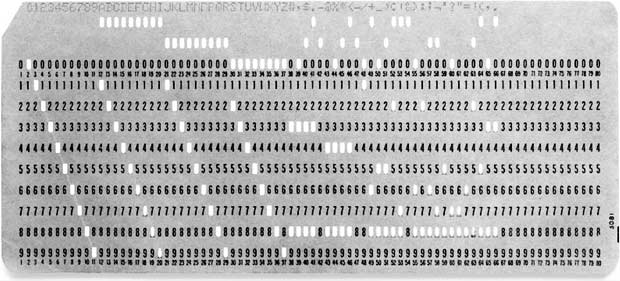
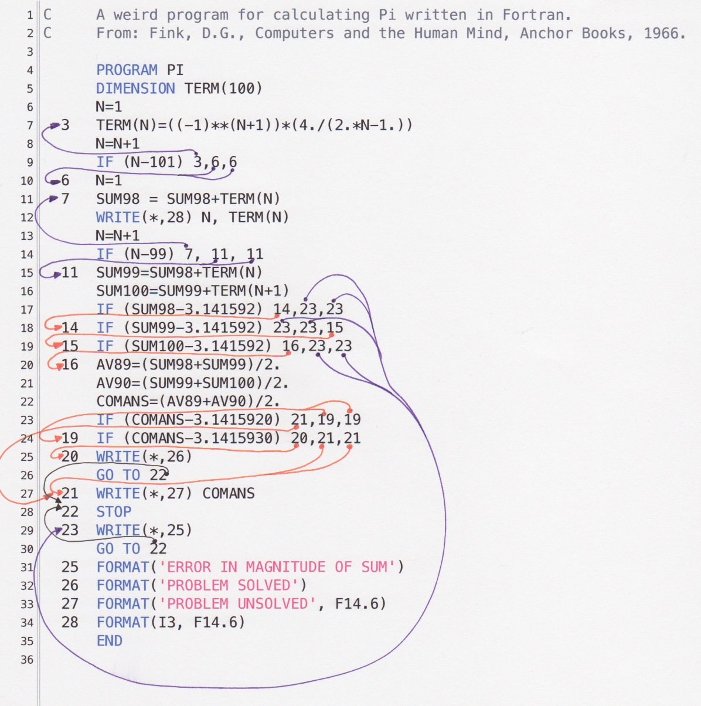
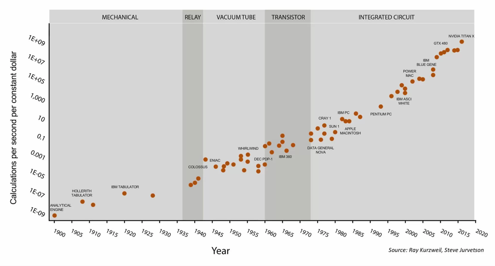
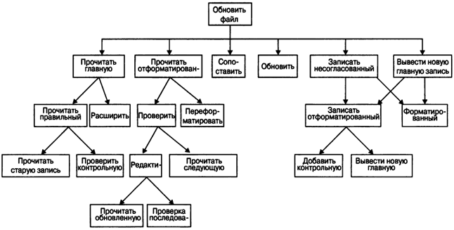
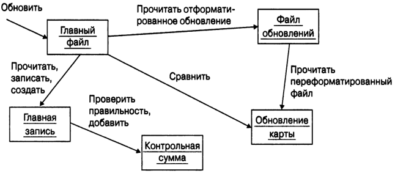
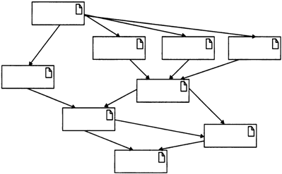
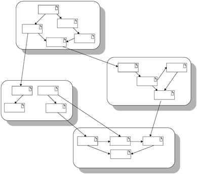

# Тема: Вступ до дисципліни ООП. Історія та передумови виникнення ОО підходу. Основні поняття та завдання ОО підходу. Переваги та недоліки ОО підходу.

> Якби будівельники будували будівлі так само, як програмісти пишуть програми, перший дятел, що залетів, зруйнував би цивілізацію.
(с) Другий закон Вейнберга

Будь-яка комп'ютерна програма, в кінцевому підсумку, зводиться до машинного коду - набору двійкових інструкцій, які виконуються центральним процесором.

Щоб задати ці інструкції, на зорі комп'ютерної ери, у 40-х роках ХХ століття, від програмістів вимагали фізично використовувати різні перемикачі та змінювати місце розташування різних перемичок. Це було жахливо незручно, оскільки комп'ютерну програму необхідно було вводити в комп'ютер вручну.

<p align="center" style="margin:auto">
  
</p>

ENIAC, 27-тонний клубок із 18000 електронних ламп і діодів, що займав площу в 167 квадратних метрів, вважається першим у світі справжнім комп'ютером. Машина могла виконати 5 000 операцій за секунду.

У 50-х роках комп'ютери почали використовувати перфокарти. Перфокарти являли собою картонні картки, в яких необхідно було виконати в потрібних місцях отвори, щоб задати необхідні інструкції.

<p align="center" style="margin:auto">
  
</p>

## Мови низького рівня

На початку комп'ютерної ери для програмування комп'ютерів використовувався машинний код. Він являв собою прямий набір інструкцій процесора, а також аргументи для тієї чи іншої інструкції. Наведемо приклад програми для виведення напису "Hello, world!" машинним кодом.

```
b8    21 0a 00 00   #moving "!\n" into eax
a3    0c 10 00 06   #moving eax into first memory location
b8    6f 72 6c 64   #moving "orld" into eax
a3    08 10 00 06   #moving eax into next memory location
b8    6f 2c 20 57   #moving "o, W" into eax
a3    04 10 00 06   #moving eax into next memory location
b8    48 65 6c 6c   #moving "Hell" into eax
a3    00 10 00 06   #moving eax into next memory location
b9    00 10 00 06   #moving pointer to start of memory location into ecx
ba    10 00 00 00   #moving string size into edx
bb    01 00 00 00   #moving "stdout" number to ebx
b8    04 00 00 00   #moving "print out" syscall number to eax
cd    80            #calling the linux kernel to execute our print to stdout
b8    01 00 00 00   #moving "sys_exit" call number to eax
cd    80            #executing it via linux sys_call
```

Для того, щоб писати в машинних кодах, потрібно досконало знати внутрішній устрій комп'ютера і подробиці роботи центрального процесора. Також, різні центральні процесори різних фірм мали свій набір команд, що призводило до того, що програма в машинних кодах писалася під конкретну модель центрального процесора.

### Мова асемблера

Роком народження мови асемблера можна вважати 1949 рік. Мова асемблера являє собою систему позначень, яка дозволяє полегшити написання програм у машинному коді. Замість кодів команд використовуються спеціальні позначення (мнемоніки), наприклад `MOV` або `ADD`. Також, можна було використовувати різні системи числення, а також давати міткам символічні імена. Наведемо приклад програми, яка друкує на екрані "Hello, world!" (діалект NASM Linux).

```nasm
SECTION .data
msg db "Hello, world!",0xa  
len equ $ - msg
SECTION .text
global _start           
_start:              ; Точка входу в програму
        mov eax, 4   ; 'write' системний виклик
        mov ebx, 1     
        mov ecx, msg ; Покажчик на дані
        mov edx, len ; Кількість даних
        int 0x80     ; Виклик ядра
        mov eax, 1   ; '_exit' системний виклик 
        mov ebx, 0   ; Повертаємо 0 (усе добре)
        int 0x80     ; Виклик ядра
```

Необхідно зазначити, що інструкції мовою асемблера один в один транслюються в інструкції в машинних кодах (принаймні, так було спочатку). Мова асемблера надає більш зручну форму запису інструкцій для процесора.

Особливістю програмування в машинних кодах і мовою асемблера було те, що процес розроблення таких програм був дуже повільним, налагодження та пошук помилок займали величезну кількість часу, а самі програми являли собою наукові розрахунки для військової або аерокосмічної галузі.

## Мови високого рівня. Неструктуровані мови програмування

### FORTRAN і неструктуровані мови програмування

З плином часу, комп'ютери ставали дедалі продуктивнішими та дешевшими. Комп'ютерами зацікавилися не тільки військові та науковці, а й різноманітні комерційні фірми, виникла потреба в розробці дедалі складніших програм, які б займалися не тільки науковими розрахунками. Існуючі мови (асемблер і мова машинних команд) не давали змоги писати великі та складні програми, до того ж, постало питання про здешевлення вартості написання програм для бізнесу.

Усе це сформувало потребу в розвитку Computer Science і появі принципово нових мов програмування, які б дали змогу писати складні програми і витрачати менше часу та грошей на їхнє виробництво, впровадження та підтримку.

Адмірал Грейс Хоппер, розробник однієї з високорівневих мов програмування, так описувала необхідність у нових інструментах для розробки комп'ютерних програм:

> Колись я була професором математики. У той час я виявила, що є студенти, які не можуть вивчати математику. Потім мені доручили зробити так, щоб підприємцям було легко користуватися нашими комп'ютерами. Виявилося, що питання не в тому, чи зможуть вони вивчати математику, а в тому, чи захочуть вони. [...] Багато хто з них говорив: "Викиньте ці символи - я не знаю, що вони означають, у мене немає часу їх вивчати". А тим, хто заявляє, що люди, які опрацьовують дані, повинні використовувати математичну нотацію, я пораджу для початку навчити математичного запису віцепрезидента або полковника чи адмірала. Запевняю вас, я вже пробувала.

Наприкінці 1953 року, співробітник IBM Джон Бекус запропонував більш практичну альтернативу мові асемблера для програмування комп'ютера IBM 704, яка називалася FORTRAN. Перший компілятор для мови FORTRAN було розроблено у квітні 1957 року.

Мова FORTRAN стала неймовірно популярною мовою високого рівня і дала змогу суттєво підвищити ефективність розроблення, впровадження та підтримки комп'ютерних програм.

Концепція мов високого рівня дає змогу суттєво спростити та прискорити процес розроблення програмного забезпечення. Основна риса високорівневих мов - це абстракція, тобто введення смислових конструкцій, що коротко описують такі структури даних та операції над ними, описи яких на машинному коді (або іншій низькорівневій мові програмування) дуже довгі та складні для розуміння.

### Недоліки неструктурованого програмування

Для того, щоб пояснити один із головних недоліків мов програмування того часу, наведемо приклад програми мовою FORTRAN

```fortran
C AREA OF A TRIANGLE WITH A STANDARD SQUARE ROOT FUNCTION
C INPUT - TAPE READER UNIT 5, INTEGER INPUT
C OUTPUT - LINE PRINTER UNIT 6, REAL OUTPUT
C INPUT ERROR DISPLAY ERROR OUTPUT CODE 1 IN JOB CONTROL LISTING
C READ INPUT TAPE 5, 501, IA, IB, IC
      read(*,*) IA, IB, IC
C  501 FORMAT (3I5)
C IA, IB, AND IC MAY NOT BE NEGATIVE OR ZERO
C FURTHERMORE, THE SUM OF TWO SIDES OF A TRIANGLE
C MUST BE GREATER THAN THE THIRD SIDE, SO WE CHECK FOR THAT, TOO
      IF (IA) 777, 777, 701
  701 IF (IB) 777, 777, 702
  702 IF (IC) 777, 777, 703
  703 IF (IA+IB-IC) 777, 777, 704
  704 IF (IA+IC-IB) 777, 777, 705
  705 IF (IB+IC-IA) 777, 777, 799
  777 STOP 1
C USING HERON'S FORMULA WE CALCULATE THE
C AREA OF THE TRIANGLE
  799 S = FLOAT(IA + IB + IC) / 2.0
      AREA = SQRT( S * (S - FLOAT(IA)) * (S - FLOAT(IB)) *
     +     (S - FLOAT(IC)))
C      WRITE OUTPUT TAPE 6, 601, IA, IB, IC, AREA
      write(*, 601) IA, IB, IC, AREA
  601 FORMAT (4H A= ,I5,5H  B= ,I5,5H  C= ,I5,8H  AREA= ,F10.2,
     +        13H SQUARE UNITS)

      END
```

Зверніть увагу на рядок

```fortran
701 IF (IB) 777, 777, 702
```

У цьому рядку перевіряється змінна `IB`. Що означає запис `777,777,702`? Якщо змінна менша або дорівнює `0`, то виконується рядок з міткою `777` - програма зупиняється з кодом помилки `1`. Якщо змінна `IB` більша за `0`, то виконується рядок з міткою `702` - відбувається перевірка змінної `IC`.

Програми того часу являли собою велике полотно коду, який був погано структурований, а розгалуження і цикли реалізовувалися за допомогою переходів на певний рядок або мітку.

У міру збільшення кількості рядків коду, такий спосіб написання програм призводив до такого явища, як "спагетті-код" (spaghetti code) - погано структурована і важка для розуміння програма.

<p align="center" style="margin:auto">
  
</p>

Спагеті-код названий так, тому що хід виконання програми схожий на миску спагеті, тобто звивистий і заплутаний. Іноді називається "кенгуру-код" (kangaroo code) через безліч інструкцій "jump".

Інструкції переходу jump повсюдно застосовуються в машинній мові та в мові асемблера, але в мовах високого рівня їхнє використання призводило до того, що коли програма розросталася до певного розміру, її модифікація, підтримка та налагодження ставала дуже дорогою і повільною.
Для прикладу, порівняйте дві програми для друку числі від `1` до `10` та їхніх квадратів, реалізованих неструктурованою мовою BASIC.

```basic
10 i = 0
20 i = i + 1
30 if i <= 10 then goto 70
40 if i > 10 then goto 50
50 print "Програму завершено."
60 end
70 print i; " у квадраті = "; i * i
80 goto 20
```

і програми, написаної в структурному стилі.

```
for i = 1 to 10
    print i; " у квадраті = "; i * i
next i
print "Програму завершено."
```

Безумовно, неструктуровані мови були величезним кроком уперед порівняно з мовами низького рівня, але вони лише на певний час відтермінували необхідність створення більш досконалих мов і парадигм програмування, які змогли б відкрити шлях до безболісного розроблення складніших програм.

## Software crisis і структурні мови програмування

Період середини з середини 60-х сьогодні відомий як "криза програмного забезпечення".

Термін software з'явився 1958 року, а вже за 10 років почали говорити про кризу програмного забезпечення - це словосполучення вперше пролунало 1968 року в доповіді Пітера Наура і Брайана Ренделла "Програмна інженерія", зачитаній на конференції Наукового комітету НАТО.

Протягом десятків років з'явилася ціла низка публікацій, присвячених Програмній кризі 1.0. За оцінкою Пера Флаттена і його колег, наведеною в доповіді від 1989 року, у середньому на здійснення проєкту розроблення ПЗ витрачалося по 18 місяців. Це консервативна оцінка, якщо врахувати, що 1988 року автори статті в Business Week цей показник назвали рівним трьом рокам, а 1982-го аналітики вказували, що на програмні проєкти йде по п'ять років.

У 1994 році у звіті про дослідження, проведеному фахівцями IBM, стверджувалося, що 68% усіх програмних проектів відстають від графіка. Там же наводилися відомості про те, що перевищення бюджетів проєктів розробки сягає 65%. Для позначення програмних систем, випущених, але невикористовуваних, навіть придумали термін shelfware - "ПЗ на полицю".

Експерти компанії Standish Group у доповіді CHAOS Manifesto, випущеній 2011 року, нарікають на високу частку провальних проєктів, щоправда, методологію аналізу та висновки, що вони застосовують, ставили під сумнів. Програмна криза 1.0, схоже, вже минула, і завдяки численним інкрементальним удосконаленням процесу розробки ПЗ ситуація все-таки змінилася на краще. Практичні зміни зрештою призвели до того, що сьогодні ПЗ, як правило, розробляється в межах бюджету і відповідає технічним вимогам. На жаль, тепер насувається криза 2.0, і, як показано на малюнку, її першопричина - нездатність створення ПЗ, яке ефективно використовує колосальні обсяги даних, що з'явилися за останні 50 років, а також враховує зрослі технічні характеристики пристроїв і вимоги їхніх користувачів.

<p align="center" style="margin:auto">
  
</p>

Щоб продемонструвати зростання обчислювальних потужностей протягом 60х років, наведемо один приклад. Мейнфрейм IBM 1401, випущений у 1959 році, виконував до 193 300 операцій додавання за хвилину. Модель IBM 360/91, випущена 1968 року, виконувала до 16 600 000 операцій додавання за секунду!

Наведемо уривок із виступу Едсгера Дейкстри на врученні Премії Тюрінга 1972 року.

> Основна причина кризи програмного забезпечення полягає в тому, що комп'ютери стали на кілька порядків потужнішими! Простіше кажучи: поки не було машин, програмування взагалі не було проблемою; коли в нас було кілька слабких комп'ютерів, програмування стало невеликою проблемою, а тепер, коли в нас з'явилися гігантські комп'ютери, програмування стало настільки ж гігантською проблемою.

Відповідно до парадигми, будь-яка програма, яку будують без використання оператора go to, складається з трьох базових керівних конструкцій: послідовність, розгалуження, цикл; крім того, використовуються підпрограми. При цьому розробка програми ведеться покроково, методом "зверху вниз".

Методологія структурного програмування з'явилася як наслідок зростання складності розв'язуваних на комп'ютерах завдань, і відповідно, ускладнення програмного забезпечення. У 1970-ті роки обсяги і складність програм досягли такого рівня, що традиційне (неструктуроване) розроблення програм перестало задовольняти потреби практики. Програми ставали занадто складними, щоб їх можна було нормально супроводжувати. Тому потрібна була систематизація процесу розроблення і структури програм.

Методологію структурного розроблення програмного забезпечення було визнано "найсильнішою формалізацією 70-х років".

Стаття Дейкстри в перекладі - [ссылка](files/goto_article.pdf)

Структурне програмування засноване на принципі "виклику процедури", що є ще однією назвою "виклику функції". Процедури також називають функціями, підпрограмами або методами. Процедура містить послідовність виконуваних інструкцій. Будь-яка процедура може бути викликана в будь-який час виконання програма. Процедура може бути викликана з іншої процедури або навіть може викликати саму себе.

Спочатку, всі процедури були доступні в будь-якій частині програми, так само як і глобальні дані. У невеликих програмах це не становило жодних проблем, але що складнішою і більшою стає програма, то частіше невеликі зміни в одній частині програми могли істотно вплинути на інші частини. Складні та великі програми породжували величезну кількість заплутаних залежностей, і найменша зміна в одній процедурі могла призвести до каскаду помилок у багатьох інших процедурах, що залежали від процедури, яку змінюють.

## Структурне vs об'єктно-орієнтоване програмування

Дискусії про те, яке програмування "краще" не мають сенсу. Програмування, в тому чи іншому вигляді, полягає в розв'язанні задачі, ви можете розв'язати будь-яку задачу за допомогою будь-якої парадигми програмування, тим паче, що багато мов програмування дають змогу писати код у кількох парадигмах.

Однак, не всі парадигми дають змогу розв'язувати певні задачі однаковою мірою ефективно. Таким чином, дискусії щодо парадигми програмування не мають сенсу, доти, доки не визначено завдання, яке ви намагаєтеся вирішити. Щойно ви визначили задачу та її параметри, ви зможете зрозуміти, яка парадигма краще підходить для її вирішення.

### Складність програмного забезпечення

Одним з основних викликів під час розробки програмного забезпечення є складність програм. Цей виклик іноді називають "кризою програмного забезпечення".
Не все програмне забезпечення є складним, існує велика кількість "простих" програм, які розробляються та підтримуються однією людиною. Такі програми, як правило, мають дуже обмежений функціонал і використовуються протягом короткого періоду часу. З написанням таких програм не виникає багато проблем, тому для їх написання ви можете використовувати практично будь-які мови програмування, технології та методи розробки програмних продуктів.

Найбільші проблеми виникають при розробці промислового програмного забезпечення. Такі програми використовуються досить довго (роками та десятиліттями), і від їхньої коректної роботи залежать тисячі та навіть мільйони людей. Це можуть бути, наприклад, системи управління повітряним транспортом, залізничними перевезеннями, банківські системи, системи комунальних платежів, онлайн-ігри, популярні веб-сайти та веб-служби тощо.

Найважливішою особливістю промислової програми є її висока складність. Одному програмісту не до снаги розв'язати всі проблеми, пов'язані з проектуванням такої системи. Грубо кажучи, складність промислових програм перевищує інтелектуальні можливості окремої людини.

З часу виникнення галузі розроблення програмного забезпечення людство накопичило достатньо знань, щоб проєктувати навіть найскладніші системи програмного забезпечення, але ми досі стикаємося з величезною кількістю проблем. У чому ж справа?

Аналізуючи складні системи, ми виявляємо багато складових частин, які взаємодіють одна з одною різними досить заплутаними способами, до того ж частини і способи їхньої взаємодії можуть бути абсолютно різними. Під час проєктування та організації складних систем розробнику необхідно думати відразу багато про що. Наприклад, система управління повітряним транспортом має одночасно контролювати стан багатьох літаків, враховуючи, наприклад, їхнє місце розташування, швидкість і курс. На жаль, одна людина не може охопити всі ці деталі одночасно.
Таким чином, у нас виникає проблема складність - програмне забезпечення стає дедалі складнішим, а здібності впоратися з цією складністю залишаються обмеженими. Як же вирішити цю проблему?

### Декомпозиція програмних систем

Одним зі способів впоратися зі складністю програмних систем, це декомпозиція. Під час проєктування складного програмного забезпечення, необхідно розділяти його на дедалі менші та менші частини, кожну з яких можна обробляти незалежно одна від одної. Таким чином, замість роботи над усією програмною системою одразу, ми працюватимемо з її окремими частинами.
Одним із методів декомпозиції є алгоритмічна декомпозиція. Ви стикалися з таким видом декомпозиції на першому курсі, коли вивчали дисципліну "Алгоритмізація та програмування". Алгоритмічна декомпозиція виконується методом "згори донизу", де кожен модуль системи виконує один з етапів загального процесу. На малюнку нижче наведено частину програми, яка оновлює вміст основного файлу.
Іншим видом декомпозиції називається об'єктно-орієнтована декомпозиція, яка вам поки що невідома.

<p align="center" style="margin:auto">
  
</p>

Під час використання цього виду декомпозиції, замість поділу системи на етапи, наприклад, "Прочитати відформатоване оновлення" і "Додати контрольну суму", ми визначаємо такі об'єкти, як "Основний файл" і "Контрольна сума", які створюються під час аналізу предметної області. Нижче наведено приклад ОО-декомпозиції для тієї самої частини програми.

<p align="center" style="margin:auto">
  
</p>

У разі ОО-декомпозиції, світ являє собою сукупність автономних агентів, які взаємодіють один з одним і забезпечують більш складну поведінку системи. Дія "Прочитати відформатоване оновлення" більше не є незалежним алгоритмом, ця дія являє собою операцію, пов'язану з об'єктом "Файл оновлень". У результаті виконання цієї операції виникає інший об'єкт - "Оновлення карти". Таким чином, кожен об'єкт у такій схемі реалізує свою власну поведінку, і кожен із них моделює деякий об'єкт реального світу. З такого погляду об'єкт є матеріальною сутністю, що володіє певною поведінкою. Отримуючи повідомлення, об'єкти виконують певні операції. Така композиція заснована на об'єктах, тому й називається об'єктно-орієнтованою.

**Так який же метод декомпозиції слід використовувати? ** Використовувати обидва методи одночасно не можна - спочатку слід провести декомпозицію або за алгоритмами, або за об'єктами.

Багаторічний досвід розробників програмного забезпечення явно показує, що об'єктно-орієнтована декомпозиція має багато надзвичайно важливих переваг над алгоритмічною. Декомпозицію слід починати з об'єктів, оскільки вона полегшує впорядкування складних систем, як-от програмне забезпечення, комп'ютери, рослини, галактики та великі суспільні інститути. Переваги об'єктно-орієнтованої декомпозиції:

- зменшується розмір систем за рахунок повторного використання загальних механізмів;
- об'єктно-орієнтовані системи є гнучкішими та легше еволюціонують із часом;
- знижується ризик, що виникає під час створення складної програмної системи;
- ОО-декомпозиція дає змогу краще впоратися зі складністю, характерною для систем програмного забезпечення.

Об'єктно-орієнтована технологія заснована на використанні так званої **об'єктної моделі проектування**, або просто **об'єктної моделі**. До основних принципів цієї моделі належать **абстракція**, **інкапсуляція**, **модульність**, **ієрархія**, **контроль типів**, **паралелізм** і **персистентність**.

Мови, які реалізують об'єктну модель, називають об'єктними або об'єктно-орієнтованими. Приклад структури програм, написаних об'єктно-орієнтованими мовами програмування, наведено на малюнку нижче.

<p align="center" style="margin:auto">
  
</p>

Основним елементом у цих мовах є модуль, який являє собою логічно пов'язану сукупність об'єктів і класів (поняття класу буде розглянуто нижче). Така структура є графом, а не деревом, як у разі використання алгоритмічних мов. Крім того, в ОО мовах виключені глобальні дані. Дані та операції об'єднуються таким чином, що основними логічними конструктивними елементами ОО систем тепер є об'єкти і класи, а не алгоритми.

Об'єктна модель допускає масштабування. У великих системах утворюються цілі кластери, що утворюють шари. Приклад структури великих систем наведено на малюнку нижче.

<p align="center" style="margin:auto">
  
</p>

## Об'єктно-орієнтоване програмування

ООП було спроектовано для того, щоб полегшити проектування, підтримку та повторне використання коду. Ключовими концепціями ООП є інкапсуляція та абстракція, які використовуються для допомоги в розробці великих і складних програм. ООП - це інструмент для створення програм у мільйони рядків коду в такий спосіб, щоб програми можна було розуміти, керувати та підтримувати.

Коректне використання ООП дає змогу робити код простішим, безпечнішим і простішим для розуміння та подальшої модифікації. ООП також допомагає повторно використовувати функціонал в іншій частині програми або навіть в іншій програмі без серйозної модифікації. Це допомагає знизити повторне написання одного й того самого коду та роботу програміста загалом.

ООП також допомагає робити код стабільнішим і знижує кількість багів, тому що коли частина коду коректно протестована, ви можете бути впевненими, що код не призведе до помилок під час використання його в іншій частині програми.
