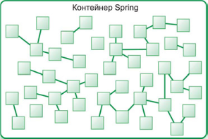

# Принцип інверсії управління та впровадження залежностей. Використання Spring Core для впровадження залежностей

Будь-який більш-менш серйозний додаток складається з декількох класів, які взаємодіють один з одним, щоб реалізовувати бізнес-логіку. Зазвичай, кожен об'єкт відповідає за отримання посилань на інші об'єкти, з якими він взаємодіє (такі інші об'єкти називаються **залежностями**, **dependencies**). Такий підхід може призвести до створення тісно пов'язаного коду, який важко тестувати.

Розглянемо невелику ділянку коду, яка складається з класу `User` і класу `Sender`.

```java
public class User {

    public void sendMessage(String message, String target) {
        Sender sender = new Sender();
        sender.send(message, target);
    }
}

public class Sender {

    public void send(String message, String target) {
        System.out.println("Tweet: " + message + " to " + target);
    }
}
```

У результаті ми отримаємо тісно пов'язаний код - клас `User` тепер безпосередньо залежить від класу `Sender`. Таким чином, якщо ми створимо клас `EmailSender`, який надсилатиме повідомлення електронною поштою, то щоб використовувати об'єкт класу `EmailSender`, нам доведеться змінювати код класу `User`. До того ж, тестування методу `sendMessage()` буде скрутним.

Безумовно, ми не можемо уникнути зв'язування взагалі, оскільки об'єктно-орієнтоване програмування передбачає взаємодію безлічі об'єктів різних класів, програма з одного класу не має сенсу. З іншого боку, нам необхідно уникати **тісного зв'язування** (**tight coupling**) класів, тому що такий код важко повторно використовувати, тестувати і важко зрозуміти, як це все разом працює.

На противагу тісному зв'язуванню коду існує принцип слабо зв'язного (**loose coupling**) коду. Слабка зв'язність означає, що зміни, що вносяться в один клас, спричинять невеликі зміни в інші класи, що спростить тестування, рефакторинг, повторне використання коду. Застосунок із використанням принципу слабко зв'язного коду легше модифікується і підтримується.


## Інверсія управління

Одним із прийомів для написання слабо зв'язного коду є принцип **інверсії управління** (**Inversion of Control**, IoC). Він полягає в тому, що життєвим циклом (створенням, викликом методів і знищенням) ваших об'єктів керуєте не ви самі, а якийсь сторонній код. Звідси і термін "інверсія" - не я керую кодом, а сторонній код керує моїми класами. Він вирішує, коли створювати об'єкти моїх класів, коли викликати їхні методи і коли знищувати об'єкти. На принципі інверсії управління базується робота всіх фреймворків.

> Детально читайте про інверсію контролю [у даній статті](http://martinfowler.com/bliki/InversionOfControl.html)

Відмінність бібліотеки від фреймворка полягає в тому, що бібліотека - це, по суті, набір функцій, організованих у класи, які ви можете викликати в міру потреби. Кожен виклик виконує деяку роботу і повертає управління назад користувачеві.

З іншого боку, фреймворк втілює в собі деякий абстрактний дизайн програми зі своєю поведінкою. Для того, щоб використовувати його, ви маєте додати свій код у різні місця фреймворку, або через успадкування, або підключивши свій власний клас. Код фреймворку згодом буде викликати ваш код.

## Впровадження залежностей

Однією з реалізацій принципу інверсії керування є **впровадження залежностей** (**Dependency Injection**, DI). Цей принцип полягає в тому, що залежності класу не створюються або шукаються в самому класі, а **впроваджуються** (**inject**) ззовні деяким іншим зовнішнім джерелом (наприклад, якимось іншим об'єктом).

У статті Мартіна Фаулера "Inversion of Control Containers and the Dependency Injection pattern" цей об'єкт називається **збирачем** (**assembler**), а зараз його зазвичай називають **контейнером** (**container**) або **IoC-контейнером** (**IoC-container**).

> Стаття Мартіна Фаулера - [оригінал](https://www.martinfowler.com/articles/injection.html)

У загальному випадку, IoC-контейнер - це деякий програмний код (фреймворк, окремий клас), який здійснює впровадження залежностей у додатку і, наскільки це можливо, спрощує цей процес.

Як правило, впровадження залежності здійснюється через:

- конструктор класу (constructor injection);
- поле класу (field injection);
- вхідний аргумент методу (method injection), тобто через сеттер.

Впровадження через статичні поля і методи не рекомендується.
Фреймворк Spring, перш ніж стати багатофункціональною платформою, спочатку розроблявся як IoC-контейнер для спрощення розробки JavaEE-додатків.

<p align="center">
  
</p>

У додатках на основі фреймворку Spring прикладні об'єкти розташовуються всередині контейнера Spring. Як показано на рисунку, контейнер створює об'єкти, пов'язує їх один з одним, конфігурує і керує їхнім повним життєвим циклом, від зародження до самої їхньої смерті (або від оператора `new` до виклику методу `finalize()`).

Класи, якими керує Spring-контейнер, називаються бінами (bean) або компонентами. Контейнер створює, пов'язує між собою, а також знищує біни.

Фреймворк Spring має не один контейнер. До його складу входять кілька реалізацій контейнера, які поділяються на два різні типи.
Фабрики компонентів (bean factories) (визначаються інтерфейсом `org.springframework.beans.factory.BeanFactory`) - найпростіші з контейнерів, що забезпечують базову підтримку DI.

**Контекст додатку** (application context) (визначається інтерфейсом `org.springframework.context.ApplicationContext`) ґрунтується на понятті фабрик компонентів і реалізує прикладні служби фреймворка, як-от можливість прийому текстових повідомлень із файлів властивостей і можливість підписувати інші програмні компоненти на події, що виникають у додатку.

З фреймворком Spring можна працювати, використовуючи і фабрики компонентів, і контексти додатків, але для більшості додатків фабрики компонентів часто виявляються надто низькорівневим інструментом. Тому контексти додатків мають перевагу перед фабриками компонентів.

У складі Spring є кілька різновидів контекстів додатків. Три з них використовуються найчастіше:

- `ClassPathXmlApplicationContext` - завантажує визначення контексту з XML-файлу, розташованого в бібліотеці класів (classpath), і обробляє файли з визначеннями контекстів як ресурси;
- `FileSystemXmlApplicationContext` - завантажує визначення контексту з XML-файлу у файловій системі;
- `XmlWebApplicationContext` - завантажує визначення контексту з XML-файлу, що міститься всередині веб-додатка.

Давайте перепишемо наш код, щоб підготувати його до використання IoC-контейнера Spring. Керуючись принципом Dependency Inversion (не плутати з Dependency Injection, це різні принципи), створимо інтерфейс `Sender`, щоб не прив'язуватися до конкретної реалізації відправника повідомлень.

```java
public interface Sender {
    void sendMessage(String message, String target);
}
```

Створимо клас `TwitterSender`, який реалізує цей інтерфейс.

 ```java
public class TwitterSender implements Sender {

    public void sendMessage(String message, String target) {
        System.out.println("Tweet: " + message + " is sending to " + target);
    }
}
 ```

Модифікуємо клас `User`

```java
public class User {

    private Sender sender;

    public User(Sender sender) {
        this.sender = sender;
    }

    public void setSender(Sender sender) {
        this.sender = sender;
    }

    public void send(String message, String target) throws NullPointerException {
        if (sender != null) {
            sender.sendMessage(message, target);
        } else {
            throw new NullPointerException("Sender object is null");
        }
    }
}
```

Зверніть увагу на різницю - ми тепер не самі створюємо об'єкт залежності, а отримуємо його "ззовні" за допомогою аргументу конструктора або за допомогою сетера. Використання інтерфейсу дає змогу легко використовувати різні реалізації відправників повідомлень. Ще одним бонусом є зручність проведення тестування методів класу `User`, оскільки замість справжнього відправника повідомлень ми можемо підставити спеціальний мок-об'єкт (mock object), що імітуватиме роботу справжнього відправника.

### Впровадження залежності (wiring)

Отже, у нас є відповідні класи, тепер необхідно пов'язувати це все воєдино за допомогою IoC-контейнера. Яким чином передати об'єкт `TwitterSender` об'єкту `User`?

Процес створення зв'язку між компонентами застосунку зазвичай називають **wiring** (іноді цей термін перекладають як **зв'язування**, не плутайте із сильним і слабким зв'язуванням, яке перекладається як tight coupling і loose coupling).

Підключимо бібліотеки Spring, які потрібні для зв'язування компонентів. Якщо ви використовуєте Maven як збирача, відкрийте pom-файл і додайте такі залежності.

```xml
    <dependencies>
        <dependency>
            <groupId>org.springframework</groupId>
            <artifactId>spring-context</artifactId>
            <version>6.1.4</version>
        </dependency>

        <dependency>
            <groupId>org.springframework</groupId>
            <artifactId>spring-core</artifactId>
            <version>6.1.4</version>
        </dependency>
    </dependencies>
```

Важливий відступ. Ви можете не додавати бібліотеку spring-core до pom-файлу явно, код все одно працюватиме. Це пов'язано з тим, що spring-context не може працювати без spring-core, і Maven автоматично завантажить spring-core у будь-якому разі, вкажете ви її в pom-файлі чи ні. У цьому випадку бібліотека spring-core називається **транзитивною залежністю**.

> Транзитивна залежність - це залежність, яка потрібна для роботи вашої прямої залежності.

Такий механізм дає змогу уникнути ручного додавання в pom-файл усього графа залежностей - ви просто вказуєте прямі залежності, а Maven зробить все інше.

Отже, повернемося до зв'язування компонентів.

Важливий момент, який необхідно запам'ятати під час роботи з контейнером - будь-який контейнер необхідно сконфігурувати. Тобто, на плечі розробника лягає обов'язок вказати контейнеру, які компоненти створити і як їх зв'язати разом.

Spring пропонує три способи зв'язування компонентів:

- явна конфігурація за допомогою XML-файлів;
- явна конфігурація за допомогою класів Java;
- неявне виявлення бінів і автоматичне зв'язування.

У цьому випадку немає "найкращого" способу зв'язування, усі три способи мають право на життя. У цьому занятті ми розглянемо конфігурацію за допомогою класів Java і автоматичне зв'язування.

### Конфігурація за допомогою класів Java

Для початку створимо клас, у якому здійснюватиметься конфігурація. Створимо пакет config і клас `AppConfig`. Оскільки у Spring може використовуватися кілька способів зв'язування компонентів, то бажано позначити клас анотацією `@Configuration` - така анотація говорить контейнеру, що цей клас є класом конфігурації.

```java
@Configuration
public class AppConfig {...}
```

Конфігурація в класі здійснюється за допомогою методів і анотацій. Додамо в клас такий метод

```java
@Configuration
public class AppConfig {

    @Bean
    public TwitterSender twitterSender() {
        return new TwitterSender();
    }
}
```

Позначивши метод анотацією `@Bean`, ми говоримо, що цей метод повертає об'єкт, який має бути зареєстрований як бін у контексті додатка Spring (тобто, в нашому IoC-контейнері). Таким чином, ми фактично оголошуємо бін у нашому контейнері. Назва біна збігатиметься з назвою методу, у нашому випадку бін називатиметься `twitterSender`.

Тепер додамо ще один метод

```java
@Configuration
public class AppConfig {

    @Bean
    public User user() {
        return new User(twitterSender());
    }

    @Bean
    public TwitterSender twitterSender() {
        return new TwitterSender();
    }
}
```

Оголошуємо ще один бін `User` і в методі здійснюємо зв'язування бінів. У нашому випадку ми здійснюємо зв'язування через конструктор (constructor injection).

Таким чином, ми оголосили два біни - `twitterSender` і `user`, після чого зв'язали їх за допомогою constructor injection.

Тепер модифікуємо клас `Main`, створимо контейнер і спробуємо використовувати клас `User`.


```java
public class Main {

    public static void main(String[] args) {

        AnnotationConfigApplicationContext context
                = new AnnotationConfigApplicationContext(AppConfig.class);

        User user = context.getBean(User.class);
        user.send("Hello!", "Nick");
    }
}
```

Отже, спочатку ми створили об'єкт контейнера. Як реалізацію ми використовуємо клас `AnnotationConfigApplicationContext`, який є реалізацією інтерфейсу `ApplicationContext`, що дозволяє реєструвати анотовані класи конфігурації. У нашому випадку класом конфігурації є клас `AppConfig`, оголошений за допомогою анотації `@Configuration`. Після того як ви зареєструєте зазначений клас, також реєструються всі типи bean-компонентів, що повертаються за допомогою методів, які анотуються за допомогою `@Bean`.

Після створення контейнера і завантаження конфігурації, використовуємо клас `User`. Зверніть увагу, що ми не самі створюємо об'єкт класу `User` і впроваджуємо залежності, а ми просто отримуємо об'єкт із контейнера, за допомогою методу `getBean()`. Після того, як ми отримали посилання на об'єкт, викликаємо метод `send()` і отримуємо працюючий клас `User`. Перевіримо роботу додатка.

```plain
org.springframework.context.support.AbstractApplicationContext prepareRefresh
INFO: Refreshing org.springframework.context.annotation.AnnotationConfigApplicationContext@4534b60d: startup date [...]; root of context hierarchy

Tweet: Hello! is sending to Nick
```

> Непоганий матеріал з приводу конфігурації за допомогою класів можна почитати [тут](https://www.tutorialspoint.com/spring/spring_java_based_configuration.htm)

Таким чином ми реалізували зв'язування бінів за допомогою контейнера Spring і конфігурації за допомогою Java-класів. Тепер давайте розглянемо автоматичне зв'язування.

### Автоматичне зв'язування

Способ автоматического связывания является наиболее простым в использовании.
Автоматическое связывание в Spring реализуется с помощью двух механизмов:

- сканирование компонентов (component scanning) – механизм, с помощью которого Spring обнаруживает и создает экземпляры компонентов;
- автосвязывание (autowiring) – механизм, с помощью которого Spring автоматически «удовлетворяет» зависимости компонентов (to satisfy a dependency).

Совместная работа этих механизмов обеспечивает минимальное явное конфигурирование контейнера.

Перепишем наш код для использования автоматического связывания. Для того, чтобы механизм сканирования компонентов обнаружил наши классы-бины, необходимо пометить их с помощью аннотации `@Component`.

```java
@Component
public class TwitterSender implements Sender {...}

@Component
public class User {...}
```

Тот участок кода, где контейнеру необходимо осуществить внедрение зависимости, аннотируется с помощью аннотации `@Autowired`. В рамках данного примера мы решили, что внедрение зависимости происходит в методе (method injection). Обратите внимание, что это не обязательно должен быть сеттер, хотя это крайне желательно

```java
@Component
public class User {

    private Sender sender;

    @Autowired
    public void setSender(Sender sender) {
        this.sender = sender;
    }
}
```

Когда мы осуществляли конфигурацию с помощью Java-класса, мы явно указывали классы компонентов и явно создавали объекты бинов.

Однако Spring способен автоматически отсканировать пакеты проекта, обнаружить бины и создать их экземпляры. Этот механизм называется сканирование компонентов (component scanning). По умолчанию, механизм сканирования компонентов отключен. Чтобы его включить, вернемся в конфигурационный класс `AppConfig` и укажем аннотацию `@ComponentScan` перед объявлением класса.

```java
@Configuration
@ComponentScan("app")
public class AppConfig {}
```

Прежде всего, удалим из класса AppConfig написанные ранее методы - они теперь не нужны.

Также обратите внимание, что в скобках был указан базовый пакет, где необходимо осуществить сканирование. Механизм сканирования компонентов будет искать компоненты в этом и в дочернем пакетах. Также вы можете указать параметр basePackages и перечислить пакеты для сканирования.

Запустим приложение и убедимся, что автоматическое связывание работает корректно.

```plain
июл 01, 2018 4:13:21 PM org.springframework.context.support.AbstractApplicationContext prepareRefresh
INFO: Refreshing org.springframework.context.annotation.AnnotationConfigApplicationContext@2d8e6db6: startup date [Sun Jul 01 16:13:21 EEST 2018]; root of context hierarchy

Tweet: Hello! is sending to Nick
```

### Разрешение зависимости (Dependency Resolution)

Использование автоматического связывания (связывание компонентов реализуется с помощью механизмов Spring) может привести к ситуации, когда будет существовать несколько бинов, которые могут быть использованы для связывания.

Пока что у нас был только один класс, который реализовывал интерфейс `Sender`. А что, если их будет два? Создадим класс `EmailSender`

```java
@Component
public class EmailSender implements Sender {

    public void sendMessage(String message, String target) {
        System.out.println("Email: " + message + " to: " + target);
    }
}
```

Запустим приложение

```plain
	at app.Main.main(Main.java:28)
Caused by: org.springframework.beans.factory.NoUniqueBeanDefinitionException: No qualifying bean of type 'app.model.Sender' available: expected single matching bean but found 2: emailSender,twitterSender
```

Сообщение при исключении четко описывает проблему: есть два бина, которые можно внедрить в класс `User` и Spring не знает, какой из них следует внедрить и закрывается с исключением.

Чтобы избавиться от данной проблемы, можно дать указания контейнеру, какой из компонентов следует выбрать в том или ином случае (ищите информацию по аннотации `@Qualifier`).

В нашем примере воспользуемся аннотацией `@Conditional`, чтобы решить проблему нескольких кандидатов на связывание.

Аннотация `@Conditional` перед объявлением класса бина означает, что бин будет доступен для регистрации в контейнере только, когда будет удовлетворено некоторое условие. В нашем случае, для каждого кандидата мы создадим отдельный класс - реализацию интерфейса `Condition`, в котором реализуем специальный метод. Если метод вернет `true`, значит условие выполнено и компонент можно зарегистрировать.
Прежде всего воспользуемся механизмом properties в Java. Создадим ресурс `app.properties` с содержимым

```plain
sender.type = email
```

В классе Main создадим объект Properties и загрузим файл

```java
public class Main {

    public static final Properties config = new Properties();

    static {
        ClassLoader loader = Thread.currentThread().getContextClassLoader();

        try (InputStream resourceStream = loader.getResourceAsStream("app.properties")) {
            config.load(resourceStream);
        } catch (IOException e) {
            e.printStackTrace();
        }
    }
}
```

Теперь у нас есть публичное статическое поле config, в котором хранятся свойства.

Создадим классы условий

```java
public class TwitterSenderCondition implements Condition {
    @Override
    public boolean matches(ConditionContext conditionContext, AnnotatedTypeMetadata annotatedTypeMetadata) {
        return Main.config.getProperty("sender.type").matches("twitter");
    }
}

public class EmailSenderCondition implements Condition {
    @Override
    public boolean matches(ConditionContext conditionContext, AnnotatedTypeMetadata annotatedTypeMetadata) {
        return Main.config.getProperty("sender.type").matches("email");
    }
}
```

В классах компонентов укажем аннотацию @Conditional и класс условия

```java
@Component
@Conditional(value = TwitterSenderCondition.class)
public class TwitterSender implements Sender {...}

@Component
@Conditional(value = EmailSenderCondition.class)
public class EmailSender implements Sender {...}
```

Теперь запустим приложение

```plain
июл 01, 2018 4:57:53 PM org.springframework.context.support.AbstractApplicationContext prepareRefresh
INFO: Refreshing org.springframework.context.annotation.AnnotationConfigApplicationContext@2d8e6db6: startup date [Sun Jul 01 16:57:53 EEST 2018]; root of context hierarchy

Email: Hello! to: Nick
```

Если мы изменим в app.properties значение с email на twitter и снова запустим приложение, то получим

```plain
июл 01, 2018 4:58:56 PM org.springframework.context.support.AbstractApplicationContext prepareRefresh
INFO: Refreshing org.springframework.context.annotation.AnnotationConfigApplicationContext@2d8e6db6: startup date [Sun Jul 01 16:58:56 EEST 2018]; root of context hierarchy

Tweet: Hello! is sending to Nick
```

Таким образом, проблема нескольких кандидатов решена.