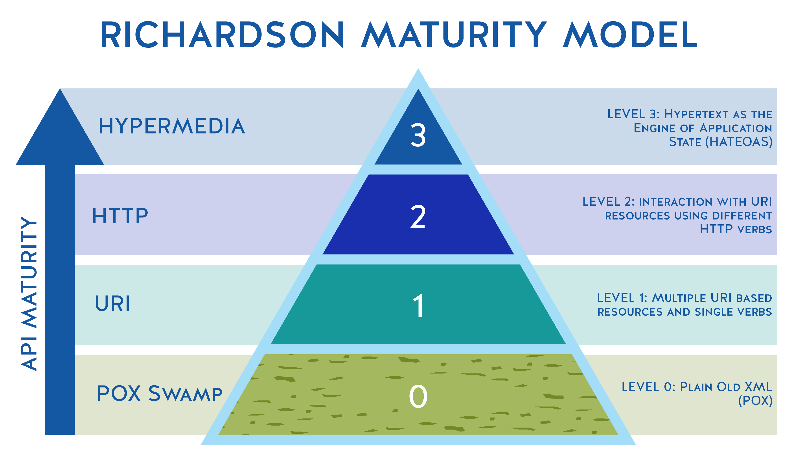

Тема: Клиент-серверная архитектура приложения. Сокеты в Java. Технология Java Servlets. Проект Spring Boot. Быстрое создание приложения с помощью Spring Boot. Архитектура Spring-приложения (web layer, service layer, repository layer).

Клиент-серверная архитектура

Сервер - компьютер или программа, которая управляет ресурсами (информация, файлы, база данных) называется сервером этого ресурса или просто сервером.
Архитектура "клиент-сервер" определяет общие принципы организации взаимодействия, где имеются серверы (узлы-поставщики некоторых специфичных функций и сервисов) и клиенты, (потребители этих сервисов).
Между клиентами и серверами должны быть установлены правила взаимодействия, которые называются протоколом взаимодействия или протоколом обмена. Каждая часть взаимодействует друг с другом, обмениваясь сообщениями в заранее согласованном формате.

Более подробно про клиент-серверное взаимодействие читайте здесь - http://bit.ly/2qmKbHk

В рамках данного курса рассматривается так называемая "трехзвенная архитектура"

Компоненты трехзвенной архитектуры:
клиент - этот компонент отвечает за представление данных конечному пользователю;
выделенный сервер приложений - здесь содержится бизнес-логика приложения;
сервер БД - предоставляет запрашиваемые данные.
Сервер приложений (application server) – сервисная программа, которая обеспечивает доступ клиентов к прикладным программам, выполняющимся на сервере.

Большинство серверов приложений имеют в своем составе веб-сервер. Это означает, что сервер приложений может делать все, на что способен веб-сервер. Кроме того, сервер приложений имеет компоненты и функции для поддержки сервисов уровня приложения, таких как пул соединений, поддержка транзакций и так далее.

Информация о сервере приложений - http://bit.ly/2qt2Q4t. 
Отличия веб-сервера и сервера приложений - http://bit.ly/2qlUaNe
Подробнее про сервлеты и контейнеры сервлетов - http://bit.ly/2Q9GAaP

Технология Java Servlets
На заре развития интернета не существовало технологий для создания динамических веб-страниц. В то время сайт представлял собой набор статических заранее написанных и сверстанных страниц с помощью языка разметки HTML. Если владелец сайта хотел обновить информацию на страничке, он делал это непосредственно на своем компьютере, после чего загружал на сервер обновленную версию HTML-страницы.
Среди предложенных решений по созданию динамических страниц, одной из первых была технология Java Servlets. В то время это была революционная технология, которая позволяла расширить возможности веб-серверов на основе модели запрос-ответ (request - response). Технология сервлетов позволяла веб-серверам обрабатывать HTTP-запросы и динамически генерировать веб-странички в зависимости от HTTP-запроса.

На данный момент актуальной версией технологии является версия 4.0, спецификацию технологии смотрите здесь. https://jcp.org/en/jsr/detail?id=369

Несмотря на почтенный возраст, технология сервлетов претерпела серьезные изменения для того, чтобы соответствовать современной технологии разработки веб-приложений. На данный момент, технология сервлетов является наиболее часто используемой технологией для обработки HTTP запросов/откликов. Кроме того, сервлеты являются базой для почти всех Java-фреймворков, которые работают с HTTP протоколом (JSF, Struts, Spring MVC, BIRT и так далее).
Сервлет (Servlet), по сути, является классом Java, который используется для расширения возможностей сервером, предназначенных для размещения приложений. Сервлеты могут отвечать на запросы и генерировать отклики. Базовым классом для всех сервлетов является класс javax.servlet.GenericServlet. Этот класс определяет обобщенный, независимый от протокола сервлет.
Схема работы технологии сервлетов представлена на рисунке ниже

клиент (например, веб-браузер) передает HTTP-запрос веб-серверу. В случае, если от веб-сервера требуется предоставить статический файл или какой-то ресурс (например, изображение), то он просто возвращает требуемый статический файл или ресурс;
если веб-сервер не может самостоятельно обработать HTTP-запрос (например, пользователь передает какие-то данные либо требуется предоставить динамическую страницу и так далее), веб-сервер передает этот запрос web-контейнеру (его еще называют servlet-контейнером);
контейнер определяет – какой сервлет может выполнить этот запрос, создает объекты классов HttpServletRequest и HttpServletResponse, создает thread, создает объект класса сервлета и передает ему объекты классов HttpServletRequest и HttpServletResponse;
Контейнер вызывает метод сервлета service(), который вызывает соответствующий HTTP-запросу метод (например, если запрос был HTTP GET, то будет вызван метод doGet(), подробнее этот вопрос будет разбираться далее), которому, в качестве аргументов, передает объекты классов HttpServletRequest и HttpServletResponse;
Соответствующий метод (например, метод doGet()) возвращает динамическую страницу внутри объекта класса HttpServletResponse, ссылку на который имеет контейнер;
После этого поток завершается, контейнер конвертирует объект класса HttpServletResponse в HTTP-отклик (HTTP response) и отдает его веб-серверу, который возвращает его клиенту.

Фреймворк Spring
Spring – свободно-распространяемый легковесный фреймворк, призванный упростить разработку корпоративных и веб-приложений (можно использовать и для любых других типов приложений) на языке Java (является альтернативной стеку Jakarta EE).

В данный момент Spring представляет собой целый набор модулей, которые можно использовать выборочно для тех или иных проектов.

Дадим краткую характеристику некоторым модулям Spring:
Spring Core – ядро платформы, предоставляет базовые средства для создания приложений — управление компонентами (бинами, beans), внедрение зависимостей, MVC фреймворк, транзакции, базовый доступ к БД. В основном это низкоуровневые компоненты и абстракции. По сути, неявно используется всеми другими компонентами;
Spring MVC – обеспечивает архитектуру паттерна Model-View-Controller при помощи слабо связанных готовых компонентов для разработки веб-приложений;
Spring Data – обеспечивает доступ к данным: реляционные и нереляционные БД, KV хранилища и т.п.;
Spring Cloud – используется для микросервисной архитектуры;
Spring Security – авторизация и аутентификация, доступ к данным, методам и т.п. OAuth, LDAP, и различные провайдеры.
Spring Boot
Проект Spring Boot – решение, которое позволяет вам легко создавать полноценные приложения Spring, про которые можно сказать «просто запусти».
Spring Boot позволяет быстро создать и сконфигурировать (т.е. настроить зависимости между компонентами) приложение, упаковать его в исполняемый самодостаточный артефакт. Это то связующее звено, которое объединяет вместе набор компонентов в готовое приложение.
Особенности Spring Boot:
создание полноценных Spring-приложений;
встроенный сервлет-контейнер (Tomcat или Jetty);
обеспечивает начальные pom-файлы для упрощения конфигурации Maven;
используется автоконфигурация, где это возможно;
используется принцип «convention over configuration». Для большинства конфигураций не нужно ничего настраивать.
Изучение фреймворка Spring лучше всего начать с установки требуемого программного обеспечения и разработки тестового приложения с помощью Spring Boot.
Установка программного обеспечения

Для выполнения домашнего задания нам понадобится следующее программное обеспечение:
JDK - http://www.oracle.com/technetwork/java/javase/downloads/index.html;
приложение Postman - https://www.getpostman.com/downloads/;
среда разработки, которая поддерживает Spring (например, IntelliJ IDEA Ultimate Edition или дистрибутив Eclipse под названием Spring Tool Suite –  https://spring.io/tools) либо любая другая IDE с поддержкой Java и Maven.
Создание Spring Boot проекта

Существует несколько способов создать Spring Boot проект. Из наиболее простых способов можно выделить:
генерация готового проекта на сайте https://start.spring.io/ (проект Spring Initializr);
создание проекта средствами IDE.
Создадим проект с помощью мастера Intellij IDEA. Создадим новый Spring Boot проект (выберите пункт Spring Initializr). Необходимо указать JDK, метаданные проекта, а также выбрать из списка модулей нужные нам модули Spring

Для выполнения задания нам необходимо выбрать web-модуль. Панель выбранных компонентов будет иметь следующий вид:

После окончания работы мастера создания проектов, мы получим стартовый проект Spring Boot. Рассмотрим структуру проекта и обозначим ключевые файлы:

HotelApplication.java - стартовый класс Spring Boot приложения;
application.properties - файл с настройками приложения. В нем можно переопределить настройки по умолчанию;
pom.xml - POM-файл проекта. Используется сборщиком Maven.

POM-файл (Project Object Model) – это XML-файл, который содержит информацию о деталях проекта, и конфигурации для создания проекта на Maven. Он всегда находится в базовом каталоге проекта. Во время выполнения задач, Maven ищет pom-файл в базовой директории проекта. Он читает его и получает необходимую информацию, после чего выполняет задачи.
Корневым элементом является элемент <project>. Внутри тега project содержится основная и обязательная информация о проекте.

Зависимости (dependency) – это те библиотеки, которые непосредственно используются в проекте для компиляции кода или его тестирования.
Мы создаем RESTful веб-службу с помощью Spring Boot, поэтому нам нужно «подтянуть» для нашего проекта различные Spring-модули (библиотеки с классами, jar-файлы).
В обычных проектах нам бы было необходимо добавлять каждую зависимость вручную, но Spring Boot позаботился о нас и предоставил нам своего рода «мета-зависимости». Смысл их в том, что Spring Boot понимает, что если вы создаете web-приложение то вам нужен примерно одинаковый набор jar-файлов, поэтому чтобы не писать каждый jar-файл отдельно, мы указываем одну зависимость, а она уже «подтянет» за нас другие отдельные зависимости для создания веб-приложения.
Запуск приложения
Теперь давайте сразу запустим приложение. Убедимся, что приложение запущено успешно

перейдем в браузер и попробуем зайти на сайт.

Как видите, Spring Boot приложение успешно запущено. Так как Spring Boot берет на себя большую часть рутинной работы по созданию и запуску приложения, давайте разберемся, что же происходит, когда мы запускаем приложение:

Устанавливается конфигурация приложения по умолчанию;
Запускается контекст приложения Spring (Spring application context) – это контейнер для кода, который работает на сервере (службы, контроллеры и т.д.). Все приложения Spring имеют этот контекст, который запускается при запуске приложения. Spring Boot создает этот контекст при запуске приложения;
Выполняется сканирование пути к классам (class path scan). Чтобы добавить код в Spring Boot, необходимо создать свои классы и аннотировать их определенным образом. Например, если вы хотите добавить контроллер, вы создаете класс и аннотируете его с помощью аннотации @Controller и так далее. То есть, вы как бы помечаете ваши классы, что это контроллер, это сервис, это еще что-то. Spring сканирует эти классы и, в зависимости от нашего маркера, он работает с этими классами по-разному. То есть Spring сканирует ваш код и ищет классы с этими аннотациями (помимо маркеров, обычно в аннотациях содержатся другие метаданные, которые дают уточняющую информацию для Spring);
Запускается Tomcat-сервер. Мы как раз зашли на сервер через URL и получили страницу с ошибкой, так как на сервере не был предусмотрен обработчик запроса с таким URL. Мы не скачивали Tomcat и не устанавливали его – все за нас сделал Spring Boot.
Структура enterprise-приложения Spring
Простое приложение Spring имеет трехслойную структуру:
Web layer – верхний слой приложения. Он отвечает за обработку ввода пользователя и возврат корректного ответа. Также веб-слой отвечает за обработку исключений, которые могут выбрасываться в других слоях приложения. Так как веб-слой является точкой входа в приложение, он также отвечает за аутентификацию и является первой линией защиты приложения;
Service layer – слой сервисов, находится ниже веб-слоя. Этот слой содержит сервисы приложения и инфраструктуры. Сервисы приложения предоставляют публичный API сервисного слоя. Они также отвечают за транзакции и авторизацию. Инфраструктурные сервисы содержат код для взаимодействия с внешними ресурсами, такими как файловая система, базы данных, почтовые сервера и так далее. Часто эти сервисы используются несколькими сервисами приложения;
Repository layer – самый нижний слой приложения. Он отвечает за взаимодействие с используемыми хранилищами данных.

## Що таке REST? 

REST розшифровується як **REpresentational State Transfer** і є архітектурним стилем для проектування розподілених мережевих додатків. Рой Філдінг ввів термін REST у своїй докторській дисертації і запропонував наступні шість обмежень або принципів в якості його основи:

- Клієнт-сервер - обов'язки повинні бути розділені між клієнтами і серверами. Це дозволяє клієнтським і серверним компонентам розвиватися незалежно і, в свою чергу, дозволяє системі масштабуватися;
- Зв'язок між клієнтом і сервером має бути безстановим (stateless). Сервер не повинен запам'ятовувати стан клієнта. Замість цього клієнти повинні включати всю необхідну інформацію в запит, щоб сервер міг його зрозуміти і обробити;
- Багаторівнева система - між клієнтом і сервером може існувати декілька ієрархічних рівнів, таких як шлюзи, брандмауери і проксі-сервери. Шари можна додавати, змінювати, змінювати порядок або видаляти прозоро для покращення масштабованості; 
- Кеш-відповіді сервера повинні бути оголошені як кешовані або некешовані. Це дозволить клієнту або його проміжним компонентам кешувати відповіді і повторно використовувати їх для наступних запитів. Це зменшує навантаження на сервер і сприяє підвищенню продуктивності;
- Уніфікований інтерфейс - всі взаємодії між клієнтом, сервером і проміжними компонентами базуються на уніфікованості їх інтерфейсів. Це спрощує загальну архітектуру, оскільки компоненти можуть розвиватися незалежно, доки вони виконують узгоджений контракт. Обмеження уніфікованого інтерфейсу далі розбивається на чотири підобмеження: ідентифікація ресурсів, представлення ресурсів, самоописові повідомлення та гіпермедіа як двигун прикладного стану (Engine of Application State), або HATEOAS;
- Код на вимогу - клієнти можуть розширювати свої функціональні можливості, завантажуючи і виконуючи код на вимогу. Приклади включають скрипти JavaScript, аплети Java, Silverlight тощо. Це необов'язкове обмеження.

Додатки, які дотримуються цих обмежень, вважаються RESTful. Як ви могли помітити, ці обмеження не диктують фактичну технологію, яку слід використовувати для розробки додатків. Натомість, дотримання цих рекомендацій та найкращих практик зробить додаток масштабованим, видимим, портативним, надійним та здатним працювати краще. Теоретично, RESTful-додаток можна створити, використовуючи будь-яку мережеву інфраструктуру або транспортний протокол. На практиці, RESTful додатки використовують функції та можливості Інтернету і використовують HTTP як транспортний протокол.

Обмеження Уніфікованого інтерфейсу (Unified Interface) є ключовою особливістю, яка відрізняє REST-додатки від інших мережевих додатків. Уніфікований інтерфейс у REST-додатку досягається за допомогою таких абстракцій, як:

- ресурси;
- представлення;
- URI;
- методи HTTP.

### Розуміння ресурсів 

Для REST фундаментальним поняттям є поняття ресурсу (Resource). Ресурс - це все, до чого можна отримати доступ або маніпулювати ним. Приклади ресурсів включають "відео", "записи в блогах", "профілі користувачів", "зображення" і навіть матеріальні речі, такі як люди або пристрої.

Ресурси зазвичай пов'язані з іншими ресурсами. Наприклад, у додатку електронної комерції клієнт може розмістити замовлення на будь-яку кількість продуктів. У цьому сценарії ресурси продуктів пов'язані з відповідним ресурсом замовлення.

Ресурси також можуть бути згруповані в колекції. Використовуючи той самий приклад електронної комерції, "замовлення (orders)" - це колекція окремих ресурсів "замовлення (order)".

#### Ідентифікація ресурсів

Перш ніж ми зможемо взаємодіяти з ресурсом і використовувати його, ми повинні бути в змозі ідентифікувати його. Для унікальної ідентифікації ресурсів в Інтернеті використовується уніфікований ідентифікатор ресурсів (Uniform Resource Identifier, або URI). Синтаксис URI має такий вигляд: 

```
scheme:scheme-specific-part
```

Схема і конкретна частина розділяються крапкою з комою. Приклади схеми включають `http`, `ftp` або `mailto` і використовуються для визначення семантики та інтерпретації решти URI.

Візьмемо приклад URI - `http://www.apress.com/9781484208427`.

Частина `http` в цьому прикладі є схемою; вона вказує на те, що для інтерпретації решти URI слід використовувати схему `HTTP`. Схема `HTTP`, визначена в RFC 7230,2, вказує на те, що ресурс, ідентифікований нашим прикладом URI, знаходиться на машині з ім'ям хоста `apress.com`. У списку нижче наведено приклади URI і різних ресурсів, які вони представляють.

- `http://blog.example.com/posts` - представляє собою колекцію ресурсів блогів;
- `http://blog.example.com/posts/1` - представляє собою ресурс допису блогу з ідентифікатором "1"; такі ресурси називаються ресурсами-синглетонами;
- `http://blog.example.com/posts/1/comments` - представляє собою колекцію коментарів, пов'язаних із записом у блозі, позначеним "1"; такі колекції, що знаходяться під ресурсом, називаються підколекціями;
- `http://blog.example.com/posts/1/comments/245` - відображає ресурс коментарів, позначений "245".

Незважаючи на те, що URI однозначно ідентифікує ресурс, ресурс може мати більше одного URI. Наприклад, доступ до Facebook можна отримати за допомогою URI `https://`, `www.facebook.com` і `https://www.fb.com`. Термін "псевдоніми URI" використовується для позначення таких URI, які ідентифікують одні й ті ж ресурси. Псевдоніми URI забезпечують гнучкість і додаткову зручність, наприклад, необхідність вводити менше символів для доступу до ресурсу.

#### Шаблони URI

Під час роботи з REST і REST API виникають ситуації, коли вам потрібно представити структуру URI, а не сам URI. Наприклад, у додатку для блогу для URI `http://blog.example.com/2014/posts` будуть отримані всі записи блогу, створені в 2014 році. Аналогічно, URI `http://blog.example.com/2013/posts`, `http://blog.example.com/2012/posts` і т.д. повернуть записи блогу, що відповідають 2013, 2012 і т.д. рокам.

У цьому сценарії клієнту-споживачу було б зручно знати структуру URI `http://blog.example.com/year/posts`, яка описує діапазон URI, а не окремі URI.

Шаблони URI, визначені в RFC 6570 (http://tools.ietf.org/html/rfc6570), забезпечують стандартизований механізм опису структури URI. Стандартний шаблон URI для цього сценарію може бути таким: `http://blog.example.com/{year}/posts`

Фігурні дужки `{}` вказують на те, що частина шаблону з роком є змінною, яку часто називають змінною шляху. Клієнти-споживачі можуть взяти цей шаблон URI як вхідні дані, замінити змінну `year` правильним значенням і отримати записи блогу за відповідний рік. На стороні сервера шаблони URL дозволяють серверному коду легко аналізувати і отримувати значення змінних або вибраних частин URI. 

### Представлення

RESTful ресурси є абстрактними сутностями. Дані та метадані, з яких складається RESTful ресурс, повинні бути серіалізовані в представлення, перш ніж вони будуть надіслані клієнту. Це представлення можна розглядати як знімок стану ресурсу в певний момент часу.

Розглянемо таблицю бази даних в додатку електронної комерції, яка зберігає інформацію про всі доступні продукти. Коли покупець онлайн-магазину використовує браузер для купівлі товару і запитує інформацію про нього, додаток надає інформацію про товар у вигляді веб-сторінки у форматі HTML. Тепер, коли розробник нативного мобільного додатку запитує інформацію про товар, додаток електронної комерції може повернути ці дані у форматі XML або JSON.

В обох сценаріях клієнти не взаємодіяли з реальним ресурсом - базою даних, що містить інформацію про товар. Замість цього вони мали справу з його представленням.

> Зверніть увагу, що REST-компоненти взаємодіють з ресурсом, передаючи його представлення туди і назад. Вони ніколи не взаємодіють з ресурсом безпосередньо.

Як зазначено в прикладі вище, один і той самий ресурс може мати декілька представлень. Ці представлення можуть варіюватися від текстових форматів HTML, XML і JSON до двійкових форматів, таких як PDF, JPEG і MP4. Клієнт може запросити певне представлення, і цей процес називається узгодженням контенту.

Ось дві можливі стратегії узгодження вмісту:

- Постфіксація URI з бажаним представленням - у цій стратегії клієнт, який запитує інформацію про продукт у форматі JSON, використовує URI `http://www.example.com/products/143.json`. Інший клієнт може використовувати URI `http://www.example.com/products/143.xml`, щоб отримати інформацію про продукт у форматі XML;
- Використання заголовка Accept - клієнти можуть заповнити заголовок HTTP Accept бажаним представленням і надіслати його разом із запитом. Додаток, що обробляє ресурс, використає значення заголовка Accept для серіалізації запитуваного представлення. RFC 26163 надає детальний набір правил для визначення одного або декількох форматів та їхніх пріоритетів.

> Зверніть увагу, що JSON став стандартом де-факто для REST-сервісів. Всі приклади в цій книзі використовують JSON як формат даних для запитів і відповідей.

### Методи HTTP

Обмеження "Уніфікованого інтерфейсу" обмежує взаємодію між клієнтом і сервером за допомогою декількох стандартизованих операцій або дієслів. В Інтернеті стандарт HTTP4 надає вісім методів HTTP, які дозволяють клієнтам взаємодіяти і маніпулювати ресурсами. Деякі з найпоширеніших методів - це `GET`, `POST`, `PUT` і `DELETE`. Перш ніж ми заглибимося в методи HTTP, давайте розглянемо їх дві важливі характеристики - безпеку та ідемпотентність.

> У специфікації HTTP використовується термін **метод** для позначення дій HTTP, таких як GET, PUT і POST. Однак, термін **HTTP-дієслово** також використовується як взаємозамінний.

#### Безпека

Метод HTTP вважається безпечним, якщо він не спричиняє жодних змін у стані сервера. Розглянемо такі методи, як `GET` або `HEAD`, які використовуються для отримання інформації/ресурсів з сервера. Ці запити, як правило, реалізовані як операції тільки для читання, не спричиняють жодних змін у стані сервера і, отже, вважаються безпечними. 

Для отримання ресурсів використовуються безпечні методи. Однак безпека не означає, що метод повинен щоразу повертати одне і те ж значення. Наприклад, `GET`-запит для отримання акцій Google може призвести до різних значень для кожного виклику. Але до тих пір, поки він не змінює жодного стану, він все ще вважається безпечним. 

У реальних реалізаціях безпечна робота може мати побічні ефекти. Розглянемо реалізацію, в якій кожен запит про ціни на акції реєструється в базі даних. З пуристичної точки зору, ми змінюємо стан всієї системи. Однак, з практичної точки зору, оскільки за ці побічні ефекти відповідає виключно серверна реалізація, операція все ще вважається безпечною.

#### Ідемпотентність

Операція вважається ідемпотентною, якщо вона призводить до того ж стану сервера, незалежно від того, чи застосовуємо ми її один раз або будь-яку кількість разів.

Такі методи HTTP, як `GET`, `HEAD` (які також є безпечними), `PUT` і `DELETE` вважаються ідемпотентними, що гарантує, що клієнти можуть повторити запит і очікувати того ж ефекту, що і при першому запиті. Другий і наступні запити залишають стан ресурсу в тому ж стані, що і перший запит.

Розглянемо сценарій, в якому ви видаляєте замовлення в додатку електронної комерції. Після успішного завершення запиту замовлення більше не існує на сервері. Отже, будь-які майбутні запити на видалення цього замовлення все одно призведуть до того ж стану сервера.

На противагу цьому, розглянемо сценарій, в якому ви створюєте замовлення за допомогою `POST`-запиту. Після успішного завершення запиту буде створено нове замовлення. Якщо ви повторно відправите той самий `POST`-запит, сервер просто виконає його і створить нове замовлення. Оскільки повторний `POST`-запит може призвести до непередбачуваних побічних ефектів, `POST` не вважається ідемпотентним. 

#### GET


### Коди стану HTTP

Коди стану HTTP дозволяють серверу повідомляти результати обробки запиту клієнта. Ці коди стану згруповані в наступні категорії:

- Інформаційні коди - коди стану, які вказують на те, що сервер отримав запит, але ще не завершив його обробку. Ці проміжні коди відповіді належать до серії 100;
- Коди успіху - коди стану, які вказують на те, що запит був успішно отриманий і оброблений. Ці коди належать до серії 200;
- Коди перенаправлення - коди стану, які вказують на те, що запит було оброблено, але клієнт повинен виконати додаткову дію для завершення обробки запиту. Ці дії зазвичай включають перенаправлення в інше місце для отримання ресурсу. Ці коди належать до серії 300;
- Коди помилок клієнта - коди стану, які вказують на те, що в запиті клієнта виникла помилка або проблема. Ці коди належать до серії 400;
- Коди помилок сервера - коди стану, які вказують на те, що на сервері сталася помилка під час обробки запиту клієнта. Ці коди належать до серії 500.

Коди стану HTTP відіграють важливу роль у розробці REST API, оскільки змістовні коди допомагають передавати правильний статус, що дозволяє клієнту реагувати належним чином.

У списку нижче показані деякі з важливих кодів стану, які зазвичай зустрічаються:

- `100 (Continue)` - вказує на те, що сервер отримав першу частину запиту і потрібно відправити решту запиту;
- `200 (OK)` - вказує на те, що все пройшло успішно;
- `201 (Created)` - вказує на те, що запит було виконано і створено новий ресурс;
- `202 (Accepted)` - вказує на те, що запит прийнято, але він все ще обробляється;
- `204 (No Content)` - вказує на те, що сервер завершив обробку запиту і не має тіла сутності для відправки клієнту;
- `301 (Moved Permanently)` - вказує на те, що запитуваний ресурс було перенесено на нове місце і для доступу до нього потрібно використовувати новий URI;
- `400 (Bad Request)` - вказує на те, що запит неправильно сформований і сервер не може зрозуміти запит;
- `401 (Unathorized)` - вказує на те, що клієнт повинен пройти аутентифікацію перед доступом до ресурсу. Якщо запит вже містить облікові дані клієнта, то 401 вказує на невірні облікові дані (наприклад, неправильний пароль);
- `403 (Forbidden)` - вказує на те, що сервер зрозумів запит, але відмовляється його виконати. Це може бути пов'язано з тим, що доступ до ресурсу здійснюється з IP-адреси, занесеної до чорного списку, або за межами дозволеного часового вікна;
- `404 (Not Found)` - вказує на те, що ресурс за запитуваною URI не існує;
- `406 (Not Acceptable)` - вказує на те, що сервер здатний обробити запит, але отримана відповідь може бути неприйнятною для клієнта. Це трапляється, коли клієнт стає занадто прискіпливим до заголовків прийняття;
- `500 (Internal Server Error)` - вказує на те, що під час обробки запиту на сервері виникла помилка і запит не може бути виконаний;
- `503 (Service Unavailable)` - вказує на те, що запит не може бути виконаний, оскільки сервер перевантажений або знаходиться на плановому обслуговуванні.

### Модель зрілості Річардсона 

Модель зрілості Річардсона (Richardson's Maturity Model, RMM), розроблена Леонардом Річардсоном, класифікує веб-сервіси на основі REST за тим, наскільки добре вони дотримуються принципів REST. На рисунку нижче показано чотири рівні цієї класифікації.

<p align="center" style="margin:auto">
  
</p>

RMM може бути корисною для розуміння різних стилів веб-сервісів, їхнього дизайну, переваг і компромісів. 

#### Нульовий рівень.

Це найпростіший рівень зрілості сервісу. Сервіси цього рівня використовують HTTP як транспортний механізм і виконують віддалені виклики процедур на один URI. Зазвичай для викликів сервісів використовуються методи `POST` або `GET` HTTP. До цього рівня належать веб-сервіси на основі SOAP і XML-RPC.

#### Перший рівень

Наступний рівень більш наближений до принципів REST і вводить декілька URI, по одному на ресурс. Складна функціональність великої кінцевої точки сервісу розбивається на декілька ресурсів. Однак сервіси цього рівня використовують одне HTTP-дієслово, зазвичай POST, для виконання всіх операцій.

#### Другий рівень

Сервіси цього рівня використовують протокол HTTP і правильно використовують дієслова HTTP і коди стану, доступні в протоколі. Веб-сервіси, що реалізують CRUD-операції, є гарними прикладами сервісів другого рівня.

#### Третій рівень

Це найдосконаліший рівень для сервісів, який побудований навколо поняття гіпермедіа як двигуна стану додатку (Hypermedia as the Engine of Application State, HATEOAS). Сервіси цього рівня забезпечують можливість виявлення, надаючи відповіді, які містять посилання на інші пов'язані ресурси та елементи керування, які підказують клієнту, що робити далі. 

### Створення RESTful API 

Розробка та реалізація красивого RESTful API - це не менше ніж мистецтво. Це вимагає часу, зусиль і декількох ітерацій. Добре розроблений RESTful API дозволяє вашим кінцевим користувачам легко використовувати API і полегшує його впровадження. На високому рівні, ось кроки, пов'язані з побудовою RESTful API:

1. Визначте ресурси - центральне місце в REST займають ресурси. Ми починаємо моделювати різні ресурси, які представляють інтерес для наших споживачів. Часто цими ресурсами можуть бути домен або сутності додатку. Однак не завжди потрібне відображення "один до одного";
2. Визначення кінцевих точок - наступним кроком є розробка URI, які зіставляють ресурси з кінцевими точками;
3. Визначення дій - визначте методи HTTP, які можна використовувати для виконання операцій над ресурсами;
4. Визначення відповідей - визначення підтримуваного представлення ресурсу для запиту і відповіді, а також правильних кодів стану, які повинні бути повернуті.


